## 2026-06-02T18:51:47.802086Z | branch: dev | source: ecd3964

- Folder: `docs/screenshots/home/20260602-185146-ecd3964`

### Home
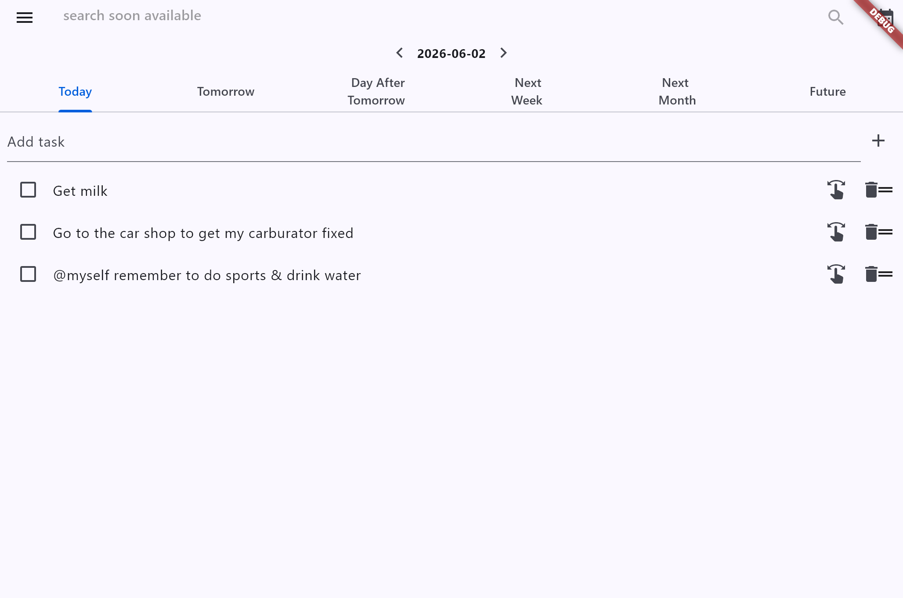

### Menu Open

### Settings
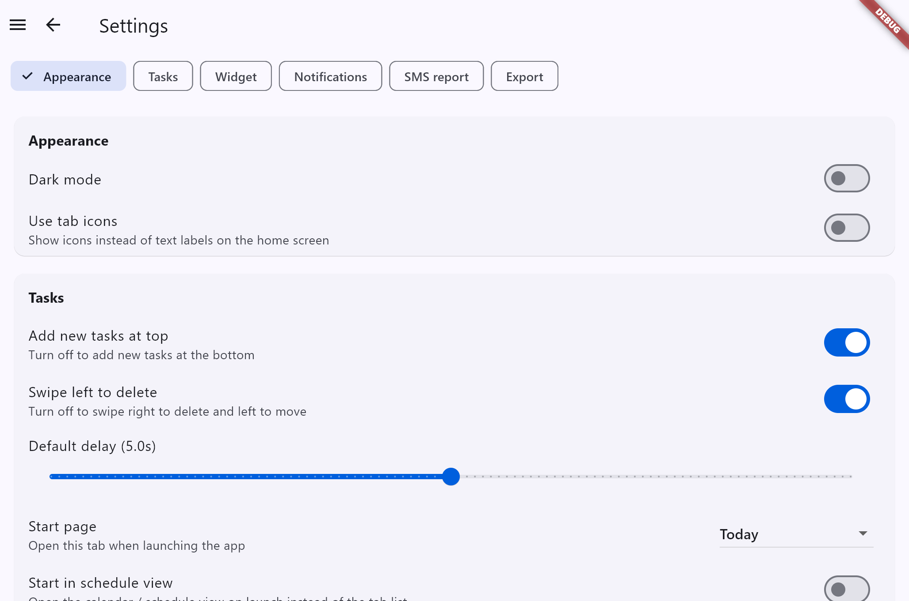

### Your Stats
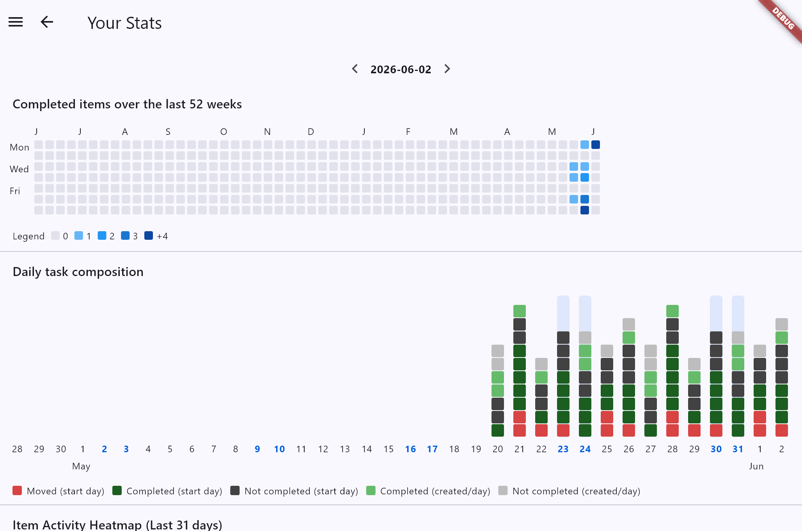

---

## 2026-05-24T08:09:15.109871Z | branch: dev | source: 083a9f1

- Folder: `docs/screenshots/home/20260524-080914-083a9f1`

### Home

### Menu Open

### Settings
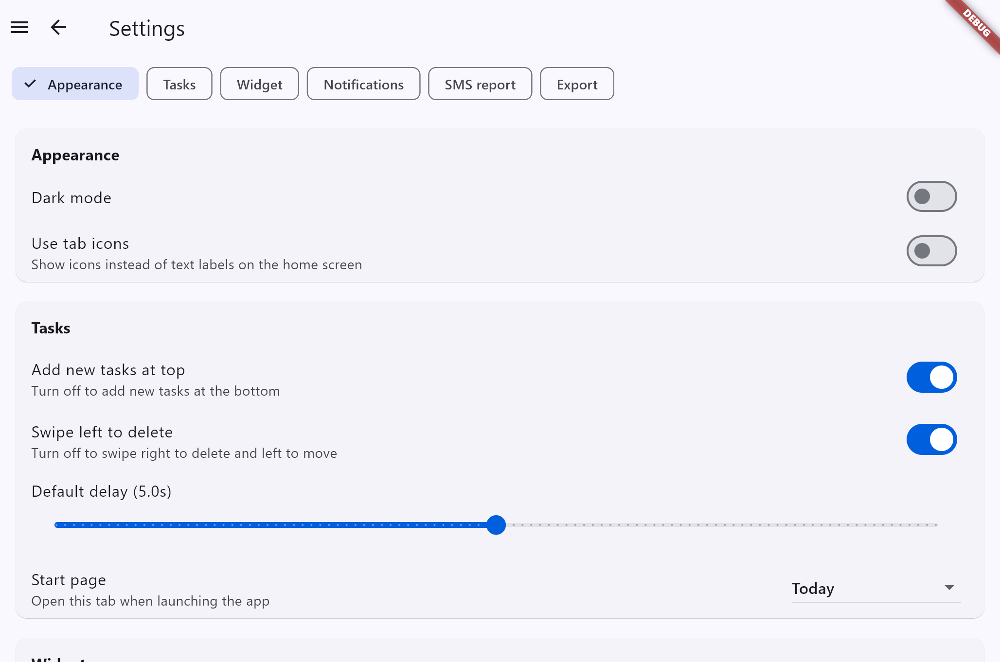

### Your Stats
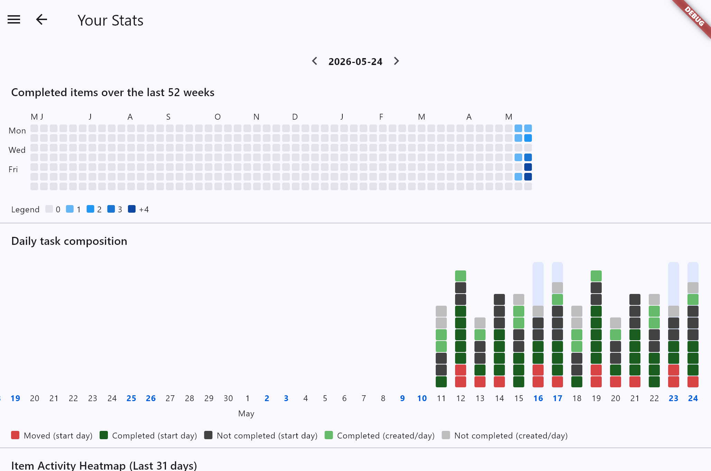

---

## 2026-05-17T07:52:54.493742Z | branch: dev | source: 51e90a2

- Folder: `docs/screenshots/home/20260517-075253-51e90a2`

### Home

### Menu Open

### Settings

### Your Stats
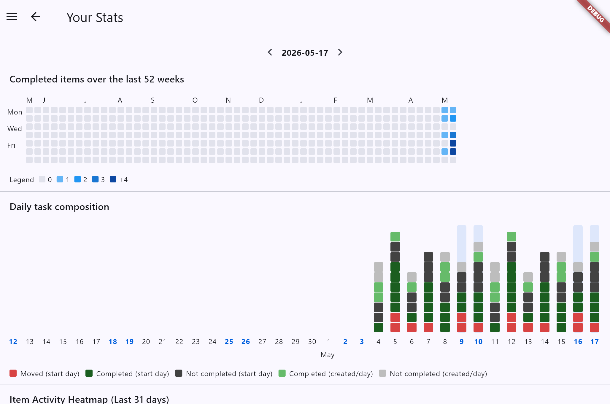

---

## 2026-05-16T11:27:20.131987Z | branch: dev | source: 80a6af6

- Folder: `docs/screenshots/home/20260516-112717-80a6af6`

### Home

### Menu Open
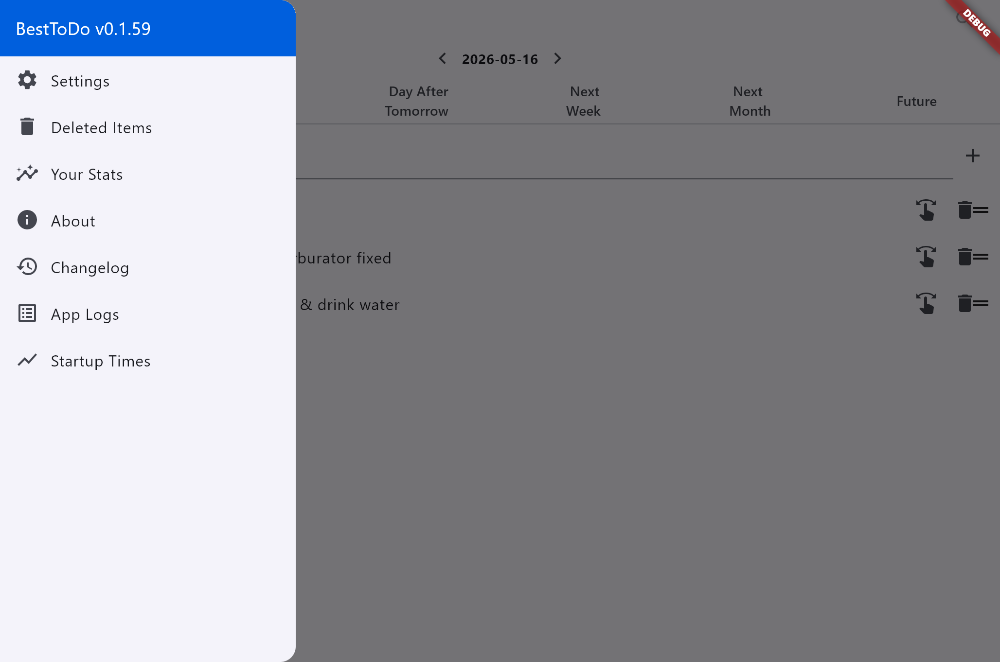

### Settings

### Your Stats
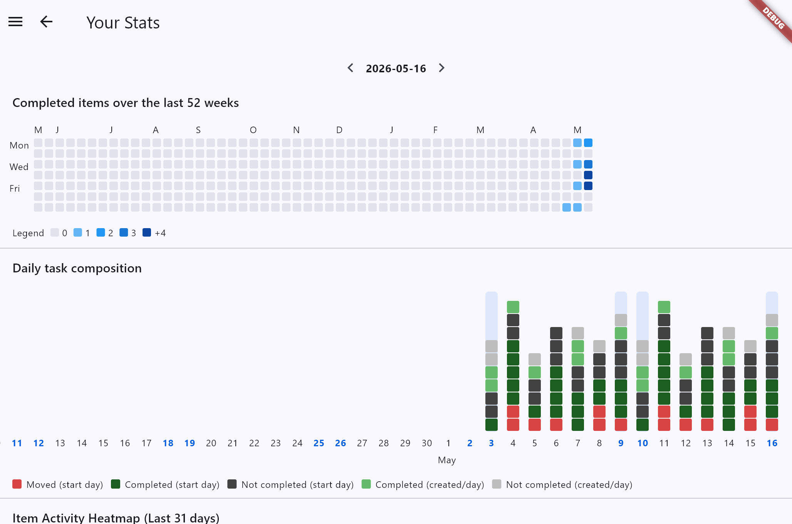

---

## 2026-05-16T11:19:11.401303Z | branch: dev | source: e22797a

- Folder: `docs/screenshots/home/20260516-111910-e22797a`

### Home

### Menu Open

### Settings

### Your Stats

## 2026-05-16T11:20:22.441647Z | branch: staging | source: 2861dfc

- Folder: `docs/screenshots/home/20260516-112021-2861dfc`

### Home
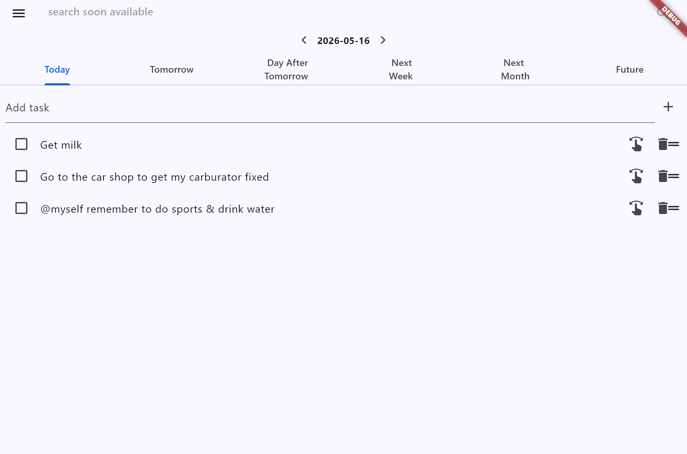

### Menu Open

### Settings
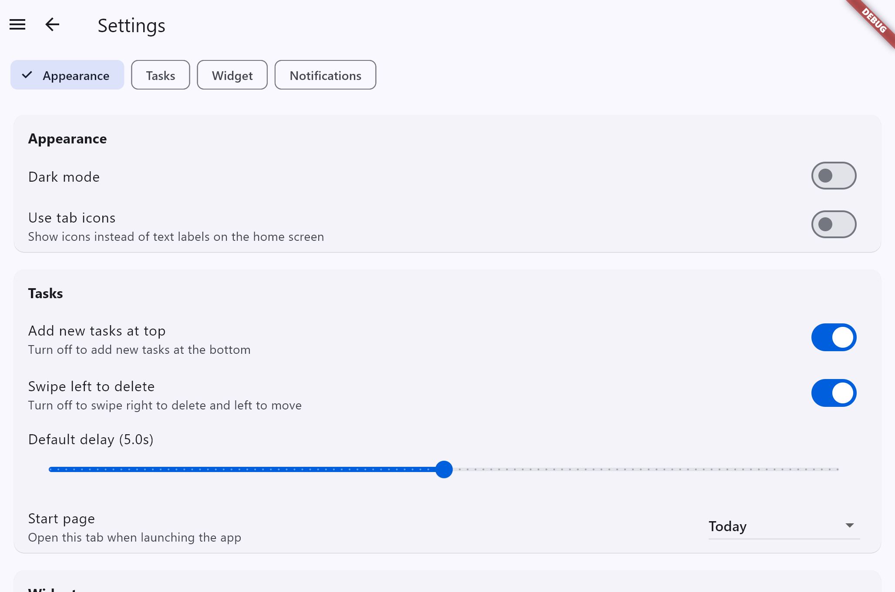

### Your Stats

---

## 2026-05-03T11:56:56.930771Z | branch: dev | source: 4fffd12

- Folder: `docs/screenshots/home/20260503-115656-4fffd12`

### Home

### Menu Open

### Settings

### Your Stats

---

## 2026-05-03T06:13:11.914028Z | branch: dev | source: 9baa5de

- Folder: `docs/screenshots/home/20260503-061310-9baa5de`

### Home

### Menu Open
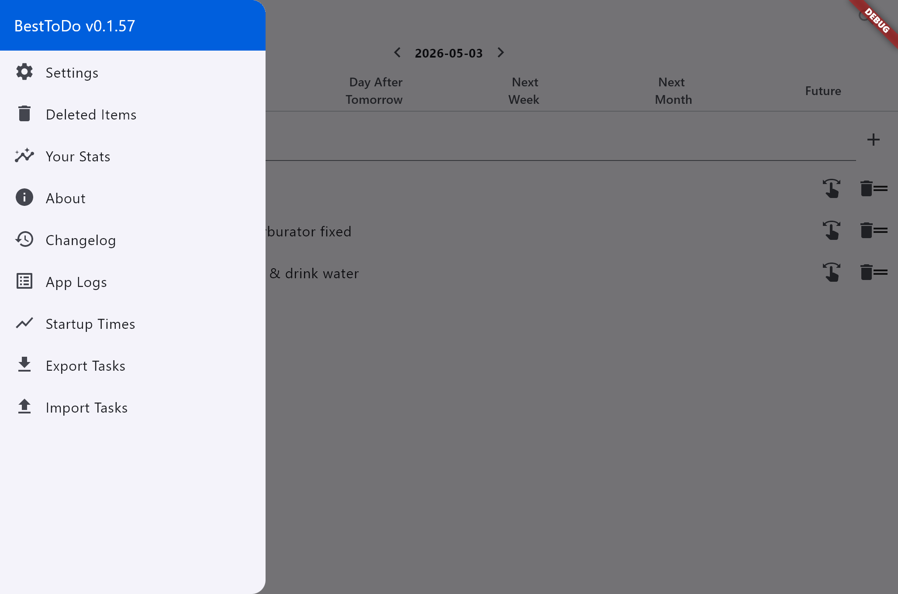

### Settings

### Your Stats
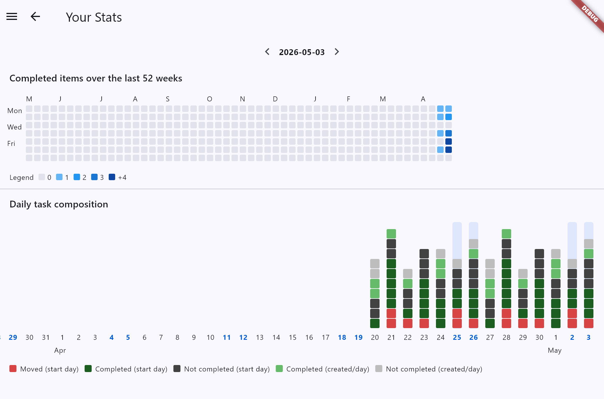

---

## 2026-05-03T05:34:05.478070Z | branch: dev | source: c6a54b4

---

# Screenshot Changelog

