<!-- screenshot-toc:start -->
# Screenshot Changelog

## Latest Screenshots

Jump to a screenshot from the most recent run:

- [Alarms Page](#alarms-page)
- [Archived Items Page](#archived-items-page)
- [Chronize Page](#chronize-page)
- [Countdown Page](#countdown-page)
- [Food Diary Page](#food-diary-page)
- [Home Page](#home-page)
- [Menu Open](#menu-open)
- [Project Board Page](#project-board-page)
- [Project Edit Dialog](#project-edit-dialog)
- [Projects Page](#projects-page)
- [Search Active](#search-active)
- [Settings Page](#settings-page)
- [Settings Section Appearance](#settings-section-appearance)
- [Settings Section Backup](#settings-section-backup)
- [Settings Section Dice Timer](#settings-section-dice-timer)
- [Settings Section Filtering Rules](#settings-section-filtering-rules)
- [Settings Section Mode Features](#settings-section-mode-features)
- [Settings Section Notifications](#settings-section-notifications)
- [Settings Section Sms Report](#settings-section-sms-report)
- [Settings Section Streak](#settings-section-streak)
- [Settings Section Sync Export](#settings-section-sync-export)
- [Settings Section Tasks](#settings-section-tasks)
- [Settings Section Todoist Sync](#settings-section-todoist-sync)
- [Settings Section Updates](#settings-section-updates)
- [Settings Section Widget](#settings-section-widget)
- [Task Open No Attachment](#task-open-no-attachment)
- [Task Open With Attachment](#task-open-with-attachment)
- [Test Results Page](#test-results-page)
- [Usage Data Page](#usage-data-page)
- [Weekly Hours Planner Page](#weekly-hours-planner-page)
- [Widget Previews Page](#widget-previews-page)
- [Wishlist Page](#wishlist-page)
- [Your Stats Page](#your-stats-page)
<!-- screenshot-toc:end -->

---

## 2026.08.27 07:03:39 | branch: dev v0.1.289+289 | source: 884a417

- Folder: `docs/screenshots/home/20260827-050338-884a417`

### Alarms Page

### Archived Items Page

### Chronize Page

### Countdown Page
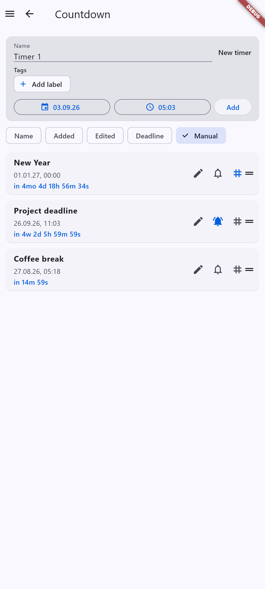

### Food Diary Page

### Home Page

### Menu Open

### Project Board Page

### Project Edit Dialog

### Projects Page

### Search Active

### Settings Page

### Settings Section Appearance

### Settings Section Backup

### Settings Section Dice Timer

### Settings Section Filtering Rules
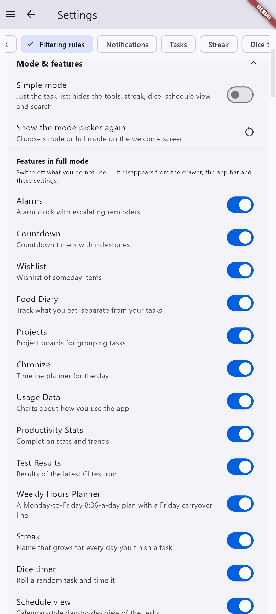

### Settings Section Mode Features

### Settings Section Notifications
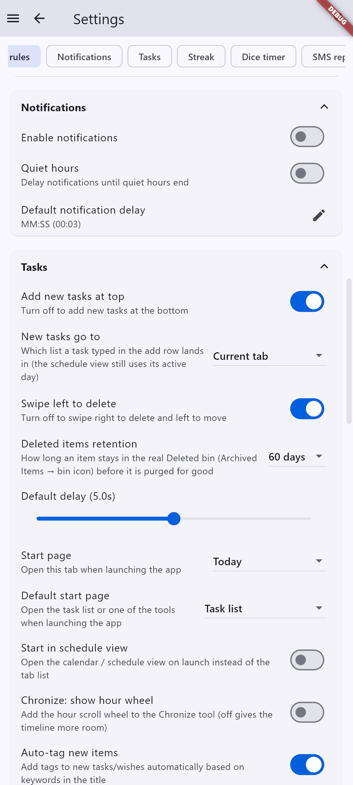

### Settings Section Sms Report

### Settings Section Streak

### Settings Section Sync Export
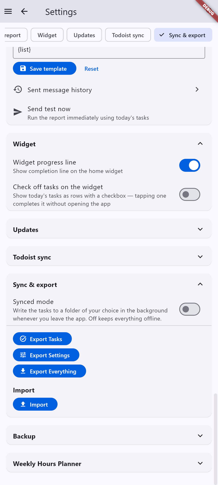

### Settings Section Tasks

### Settings Section Todoist Sync
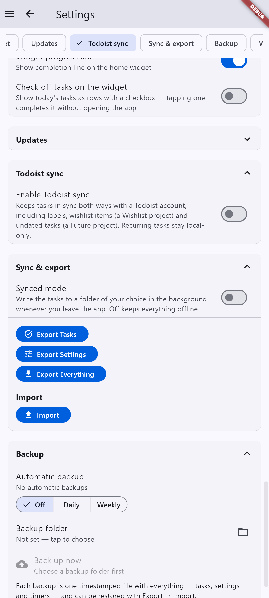

### Settings Section Updates

### Settings Section Widget

### Task Open No Attachment

### Task Open With Attachment

### Test Results Page

### Usage Data Page

### Weekly Hours Planner Page

### Widget Previews Page

### Wishlist Page

### Your Stats Page
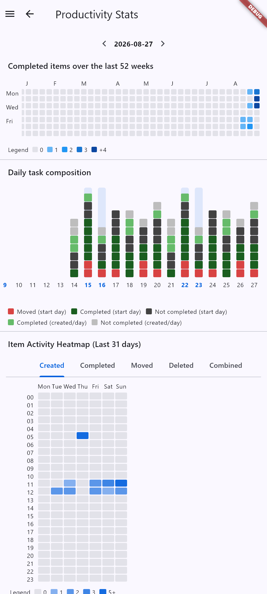

---

---

## 2026.08.27 06:49:45 | branch: dev v0.1.289+289 | source: 667f4e1

- Folder: `docs/screenshots/home/20260827-044944-667f4e1`

### Alarms Page

### Archived Items Page

### Chronize Page
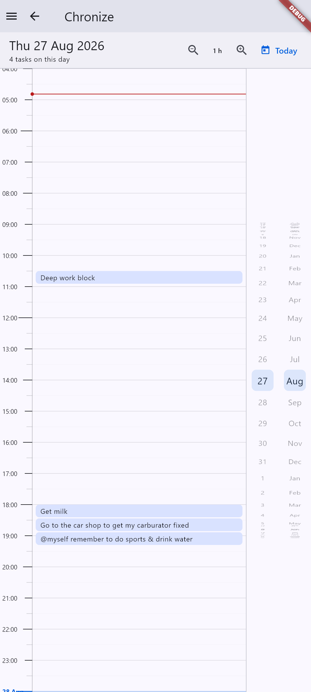

### Countdown Page

### Food Diary Page

### Home Page

### Menu Open

### Project Board Page

### Project Edit Dialog

### Projects Page

### Search Active

### Settings Page

### Settings Section Appearance
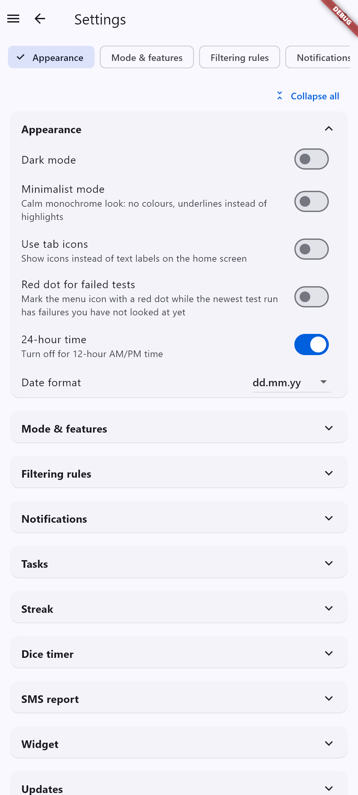

### Settings Section Backup

### Settings Section Dice Timer

### Settings Section Filtering Rules

### Settings Section Mode Features
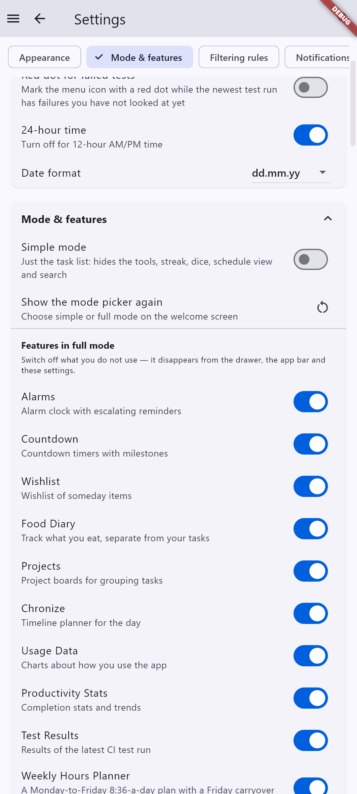

### Settings Section Notifications

### Settings Section Sms Report

### Settings Section Streak

### Settings Section Sync Export

### Settings Section Tasks

### Settings Section Todoist Sync

### Settings Section Updates

### Settings Section Widget

### Task Open No Attachment

### Task Open With Attachment

### Test Results Page

### Usage Data Page

### Weekly Hours Planner Page

### Widget Previews Page

### Wishlist Page

### Your Stats Page

---

---

## 2026.08.27 06:40:28 | branch: dev v0.1.288+288 | source: 0b5540f

- Folder: `docs/screenshots/home/20260827-044027-0b5540f`

### Alarms Page

### Archived Items Page

### Chronize Page

### Countdown Page

### Food Diary Page

### Home Page

### Menu Open

### Project Board Page

### Project Edit Dialog

### Projects Page

### Search Active

### Settings Page

### Settings Section Appearance

### Settings Section Backup

### Settings Section Dice Timer

### Settings Section Filtering Rules

### Settings Section Mode Features

### Settings Section Notifications

### Settings Section Sms Report

### Settings Section Streak

### Settings Section Sync Export

### Settings Section Tasks

### Settings Section Todoist Sync

### Settings Section Updates

### Settings Section Widget

### Task Open No Attachment

### Task Open With Attachment

### Test Results Page

### Usage Data Page

### Weekly Hours Planner Page

### Widget Previews Page

### Wishlist Page

### Your Stats Page

---

---

## 2026.08.27 06:33:08 | branch: dev v0.1.288+288 | source: 4f9a5a6

- Folder: `docs/screenshots/home/20260827-043308-4f9a5a6`

### Alarms Page

### Archived Items Page

### Chronize Page
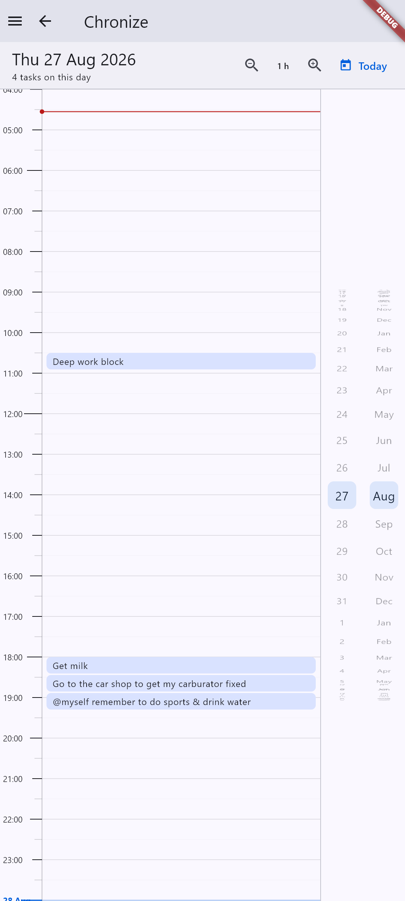

### Countdown Page

### Food Diary Page

### Home Page

### Menu Open

### Project Board Page

### Project Edit Dialog

### Projects Page

### Search Active

### Settings Page

### Settings Section Appearance

### Settings Section Backup

### Settings Section Dice Timer

### Settings Section Filtering Rules

### Settings Section Mode Features

### Settings Section Notifications

### Settings Section Sms Report

### Settings Section Streak

### Settings Section Sync Export

### Settings Section Tasks

### Settings Section Todoist Sync

### Settings Section Updates

### Settings Section Widget

### Task Open No Attachment
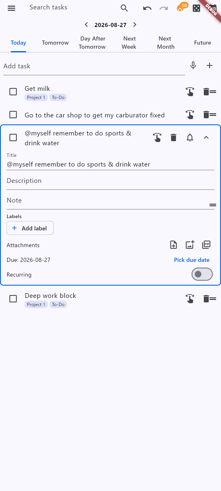

### Task Open With Attachment

### Test Results Page

### Usage Data Page

### Weekly Hours Planner Page

### Widget Previews Page

### Wishlist Page

### Your Stats Page
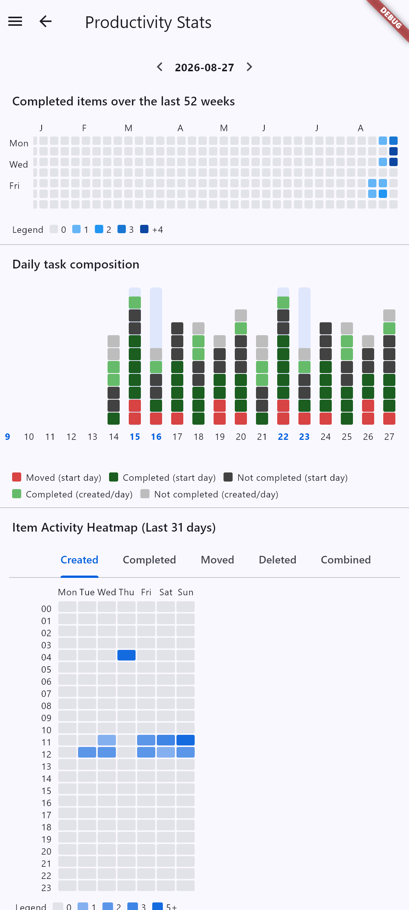

---

---

## 2026.08.27 06:21:41 | branch: dev v0.1.288+288 | source: 125dbca

- Folder: `docs/screenshots/home/20260827-042140-125dbca`

### Alarms Page

### Archived Items Page
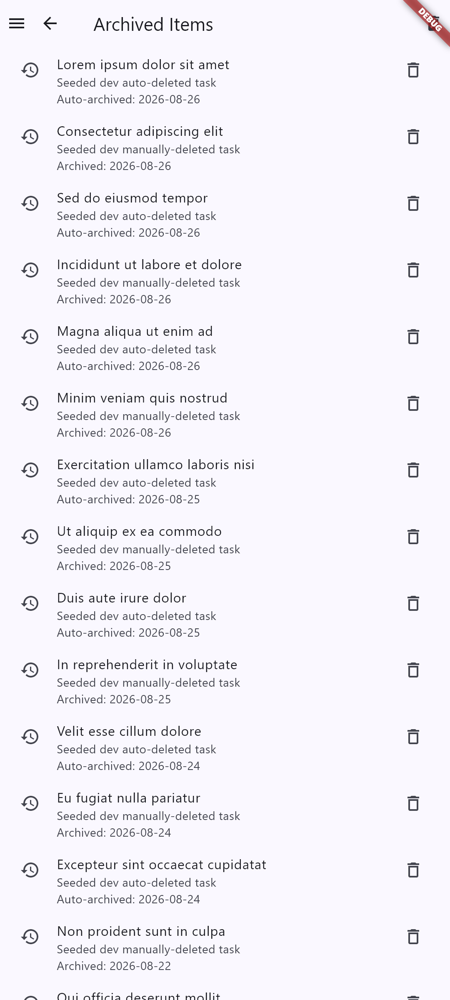

### Chronize Page

### Countdown Page

### Food Diary Page

### Home Page

### Menu Open

### Project Board Page

### Project Edit Dialog

### Projects Page

### Search Active

### Settings Page

### Settings Section Appearance

### Settings Section Backup

### Settings Section Dice Timer

### Settings Section Filtering Rules

### Settings Section Mode Features

### Settings Section Notifications

### Settings Section Sms Report

### Settings Section Streak

### Settings Section Sync Export

### Settings Section Tasks

### Settings Section Todoist Sync

### Settings Section Updates

### Settings Section Widget

### Task Open No Attachment

### Task Open With Attachment

### Test Results Page

### Usage Data Page

### Weekly Hours Planner Page

### Widget Previews Page

### Wishlist Page

### Your Stats Page

---

---

## 2026.08.26 22:16:50 | branch: dev v0.1.288+288 | source: 187b02a

- Folder: `docs/screenshots/home/20260826-201649-187b02a`

### Alarms Page

### Archived Items Page

### Chronize Page
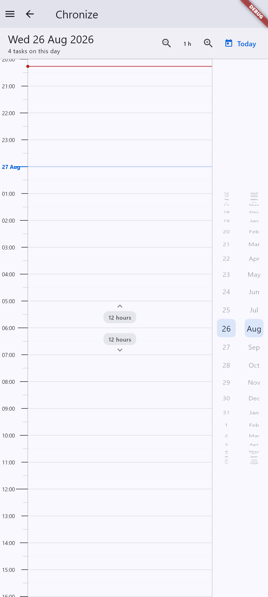

### Countdown Page

### Food Diary Page

### Home Page

### Menu Open

### Project Board Page

### Project Edit Dialog

### Projects Page

### Search Active

### Settings Page

### Settings Section Appearance

### Settings Section Backup

### Settings Section Dice Timer

### Settings Section Filtering Rules

### Settings Section Mode Features

### Settings Section Notifications

### Settings Section Sms Report

### Settings Section Streak

### Settings Section Sync Export

### Settings Section Tasks

### Settings Section Todoist Sync

### Settings Section Updates

### Settings Section Widget

### Task Open No Attachment

### Task Open With Attachment

### Test Results Page

### Usage Data Page

### Weekly Hours Planner Page

### Widget Previews Page
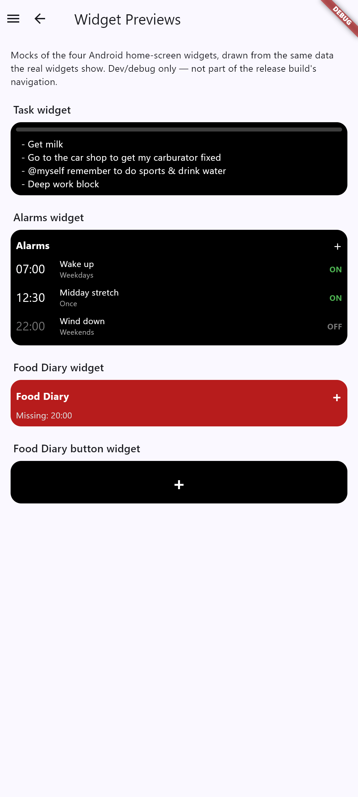

### Wishlist Page

### Your Stats Page

---

---

## 2026.08.26 21:17:49 | branch: dev v0.1.288+288 | source: 3b8258b

- Folder: `docs/screenshots/home/20260826-191748-3b8258b`

### Alarms Page

### Archived Items Page

### Chronize Page
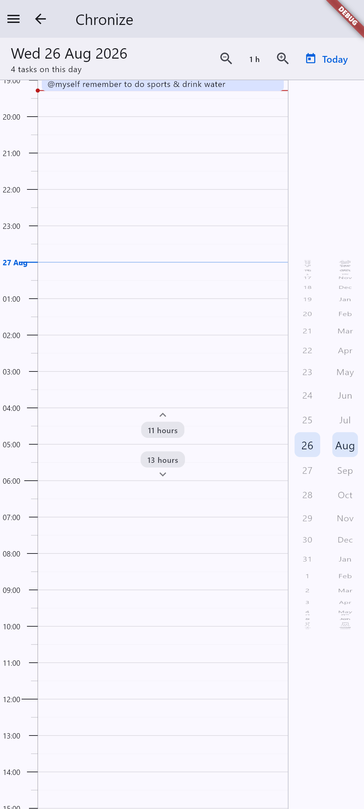

### Countdown Page

### Food Diary Page

### Home Page
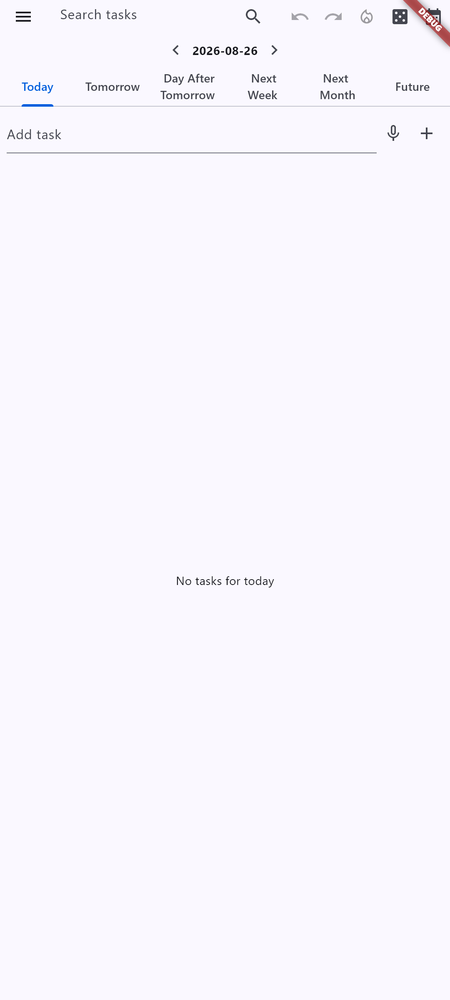

### Menu Open

### Project Board Page

### Project Edit Dialog

### Projects Page

### Search Active

### Settings Page

### Settings Section Appearance

### Settings Section Backup

### Settings Section Dice Timer

### Settings Section Filtering Rules

### Settings Section Mode Features

### Settings Section Notifications

### Settings Section Sms Report

### Settings Section Streak

### Settings Section Sync Export

### Settings Section Tasks

### Settings Section Todoist Sync

### Settings Section Updates

### Settings Section Widget

### Task Open No Attachment

### Task Open With Attachment

### Test Results Page
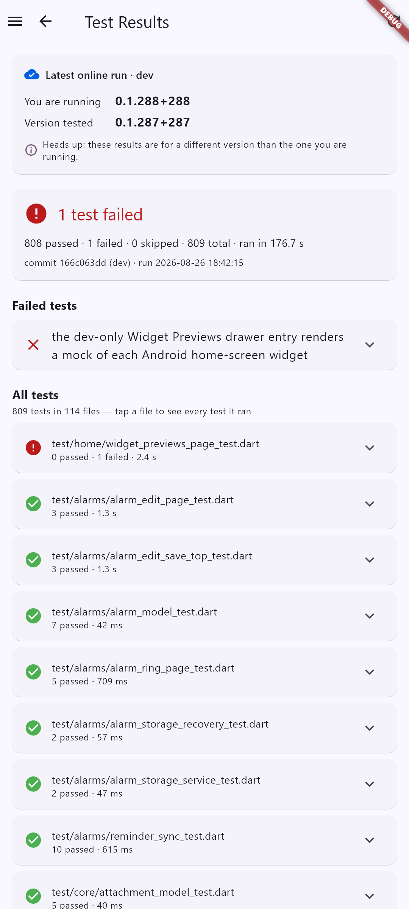

### Usage Data Page

### Weekly Hours Planner Page

### Widget Previews Page

### Wishlist Page

### Your Stats Page
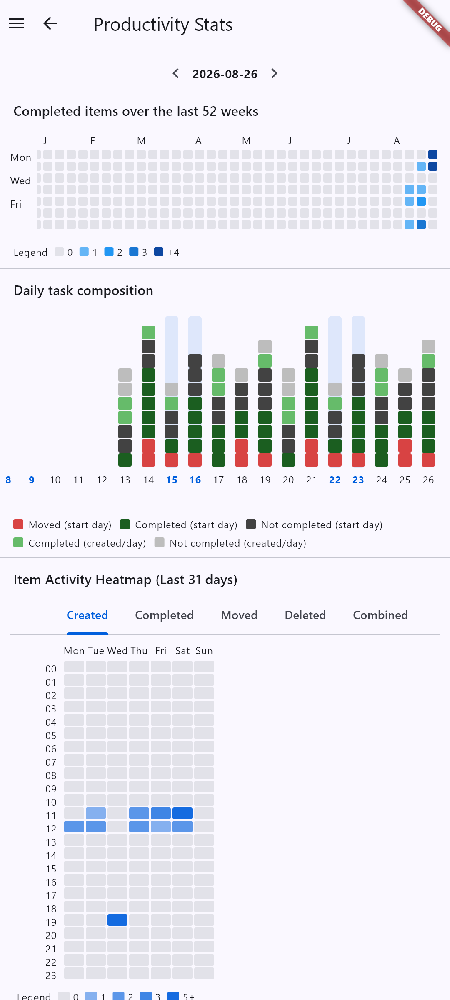

---

---

## 2026.08.26 20:41:01 | branch: dev v0.1.287+287 | source: 166c063

- Folder: `docs/screenshots/home/20260826-184100-166c063`

### Alarms Page

### Archived Items Page

### Chronize Page
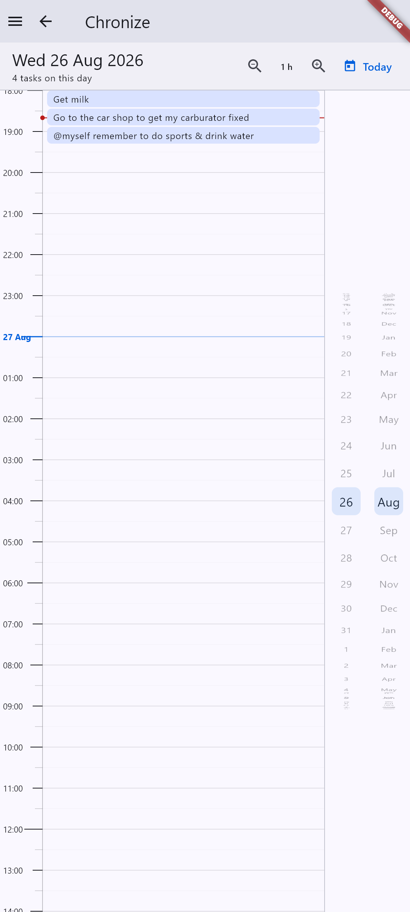

### Countdown Page

### Food Diary Page

### Home Page

### Menu Open

### Project Board Page

### Project Edit Dialog

### Projects Page

### Search Active

### Settings Page

### Settings Section Appearance

### Settings Section Backup

### Settings Section Dice Timer

### Settings Section Filtering Rules

### Settings Section Mode Features

### Settings Section Notifications

### Settings Section Sms Report

### Settings Section Streak

### Settings Section Sync Export

### Settings Section Tasks

### Settings Section Todoist Sync

### Settings Section Updates

### Settings Section Widget

### Task Open No Attachment

### Task Open With Attachment

### Test Results Page
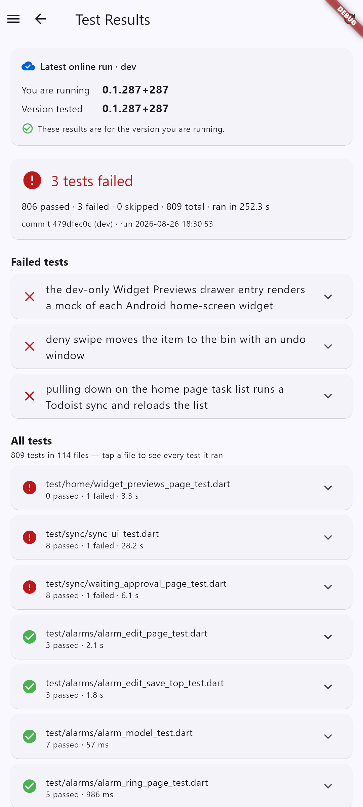

### Usage Data Page

### Weekly Hours Planner Page

### Widget Previews Page

### Wishlist Page

### Your Stats Page

---

---

## 2026.08.26 20:32:02 | branch: dev v0.1.287+287 | source: 479dfec

- Folder: `docs/screenshots/home/20260826-183202-479dfec`

### Alarms Page

### Archived Items Page

### Chronize Page

### Countdown Page

### Food Diary Page

### Home Page

### Menu Open

### Project Board Page

### Project Edit Dialog

### Projects Page

### Search Active

### Settings Page

### Settings Section Appearance

### Settings Section Backup

### Settings Section Dice Timer
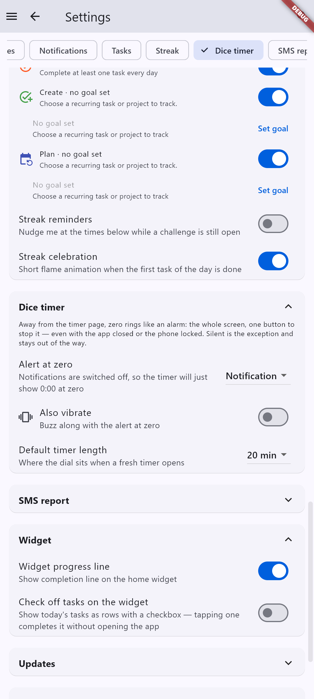

### Settings Section Filtering Rules

### Settings Section Mode Features

### Settings Section Notifications

### Settings Section Sms Report

### Settings Section Streak

### Settings Section Sync Export

### Settings Section Tasks

### Settings Section Todoist Sync

### Settings Section Updates

### Settings Section Widget

### Task Open No Attachment

### Task Open With Attachment

### Test Results Page

### Usage Data Page

### Weekly Hours Planner Page

### Widget Previews Page

### Wishlist Page

### Your Stats Page

---

---

## 2026.08.26 20:21:07 | branch: dev v0.1.287+287 | source: 04e5995

- Folder: `docs/screenshots/home/20260826-182106-04e5995`

### Alarms Page

### Archived Items Page

### Chronize Page

### Countdown Page

### Food Diary Page
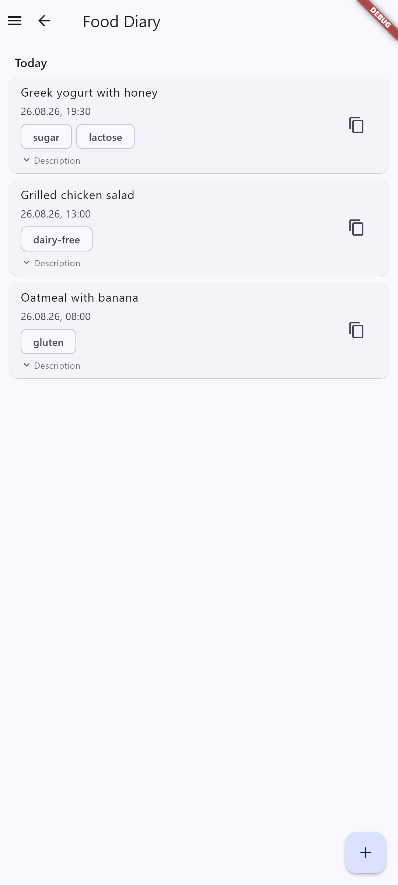

### Home Page

### Menu Open

### Project Board Page

### Project Edit Dialog

### Projects Page

### Search Active

### Settings Page

### Settings Section Appearance

### Settings Section Backup

### Settings Section Dice Timer

### Settings Section Filtering Rules

### Settings Section Mode Features

### Settings Section Notifications

### Settings Section Sms Report

### Settings Section Streak

### Settings Section Sync Export

### Settings Section Tasks

### Settings Section Todoist Sync

### Settings Section Updates

### Settings Section Widget

### Task Open No Attachment

### Task Open With Attachment

### Test Results Page

### Usage Data Page

### Weekly Hours Planner Page

### Widget Previews Page

### Wishlist Page
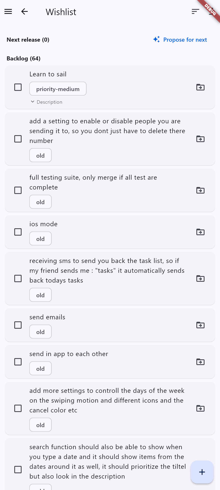

### Your Stats Page

---

---

## 2026.08.26 20:14:59 | branch: dev v0.1.287+287 | source: 9ff2953

- Folder: `docs/screenshots/home/20260826-181458-9ff2953`

### Alarms Page

### Archived Items Page

### Chronize Page

### Countdown Page

### Food Diary Page

### Home Page

### Menu Open

### Project Board Page

### Project Edit Dialog

### Projects Page

### Search Active

### Settings Page

### Settings Section Appearance

### Settings Section Backup

### Settings Section Dice Timer

### Settings Section Filtering Rules

### Settings Section Mode Features

### Settings Section Notifications

### Settings Section Sms Report

### Settings Section Streak

### Settings Section Sync Export

### Settings Section Tasks

### Settings Section Todoist Sync

### Settings Section Updates

### Settings Section Widget

### Task Open No Attachment

### Task Open With Attachment

### Test Results Page

### Usage Data Page

### Weekly Hours Planner Page

### Widget Previews Page

### Wishlist Page

### Your Stats Page

---

---

## 2026.08.26 20:00:48 | branch: dev v0.1.287+287 | source: 54c56f1

- Folder: `docs/screenshots/home/20260826-180047-54c56f1`

### Alarms Page
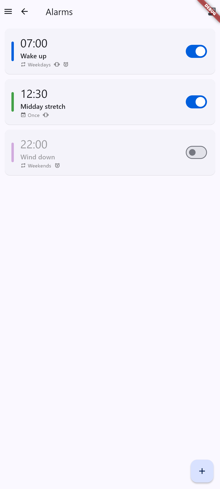

### Archived Items Page

### Chronize Page

### Countdown Page

### Food Diary Page

### Home Page

### Menu Open

### Project Board Page

### Project Edit Dialog

### Projects Page

### Search Active

### Settings Page

### Settings Section Appearance

### Settings Section Backup
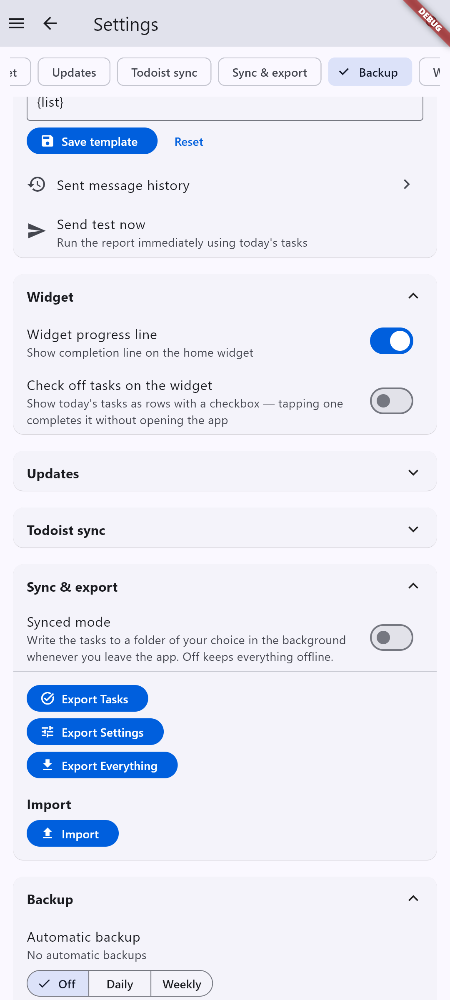

### Settings Section Dice Timer

### Settings Section Filtering Rules

### Settings Section Mode Features

### Settings Section Notifications

### Settings Section Sms Report

### Settings Section Streak

### Settings Section Sync Export

### Settings Section Tasks

### Settings Section Todoist Sync

### Settings Section Updates

### Settings Section Widget

### Task Open No Attachment

### Task Open With Attachment

### Test Results Page

### Usage Data Page

### Weekly Hours Planner Page

### Widget Previews Page

### Wishlist Page

### Your Stats Page

---

---

## 2026.08.26 19:50:37 | branch: dev v0.1.287+287 | source: eedfaf1

- Folder: `docs/screenshots/home/20260826-175036-eedfaf1`

### Alarms Page

### Archived Items Page

### Chronize Page
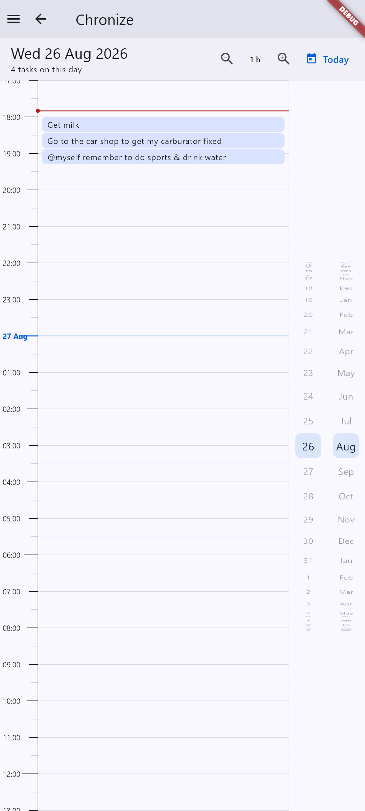

### Countdown Page

### Food Diary Page

### Home Page

### Menu Open

### Project Board Page

### Project Edit Dialog

### Projects Page

### Search Active

### Settings Page

### Settings Section Appearance

### Settings Section Backup

### Settings Section Dice Timer

### Settings Section Filtering Rules

### Settings Section Mode Features

### Settings Section Notifications

### Settings Section Sms Report

### Settings Section Streak

### Settings Section Sync Export

### Settings Section Tasks

### Settings Section Todoist Sync

### Settings Section Updates

### Settings Section Widget

### Task Open No Attachment

### Task Open With Attachment

### Test Results Page

### Usage Data Page

### Weekly Hours Planner Page

### Widget Previews Page

### Wishlist Page

### Your Stats Page

---

---

## 2026.08.26 19:42:34 | branch: dev v0.1.287+287 | source: b9943c0

- Folder: `docs/screenshots/home/20260826-174233-b9943c0`

### Alarms Page

### Archived Items Page

### Chronize Page

### Countdown Page

### Food Diary Page

### Home Page

### Menu Open

### Project Board Page

### Project Edit Dialog

### Projects Page

### Search Active

### Settings Page

### Settings Section Appearance

### Settings Section Backup

### Settings Section Dice Timer

### Settings Section Filtering Rules

### Settings Section Mode Features

### Settings Section Notifications

### Settings Section Sms Report

### Settings Section Streak

### Settings Section Sync Export

### Settings Section Tasks

### Settings Section Todoist Sync

### Settings Section Updates

### Settings Section Widget

### Task Open No Attachment

### Task Open With Attachment

### Test Results Page

### Usage Data Page

### Weekly Hours Planner Page

### Widget Previews Page

### Wishlist Page

### Your Stats Page

---

---

## 2026.08.26 19:25:21 | branch: dev v0.1.287+287 | source: 4b02c16

- Folder: `docs/screenshots/home/20260826-172520-4b02c16`

### Alarms Page

### Archived Items Page

### Chronize Page

### Countdown Page

### Food Diary Page

### Home Page

### Menu Open

### Project Board Page

### Project Edit Dialog

### Projects Page

### Search Active

### Settings Page

### Settings Section Appearance

### Settings Section Backup

### Settings Section Dice Timer

### Settings Section Filtering Rules

### Settings Section Mode Features

### Settings Section Notifications

### Settings Section Sms Report

### Settings Section Streak

### Settings Section Sync Export

### Settings Section Tasks

### Settings Section Todoist Sync

### Settings Section Updates

### Settings Section Widget

### Task Open No Attachment

### Task Open With Attachment

### Test Results Page

### Usage Data Page

### Weekly Hours Planner Page

### Widget Previews Page

### Wishlist Page

### Your Stats Page

---

---

## 2026.08.26 17:00:59 | branch: dev v0.1.286+286 | source: 40597d2

- Folder: `docs/screenshots/home/20260826-150058-40597d2`

### Alarms Page

### Archived Items Page

### Chronize Page
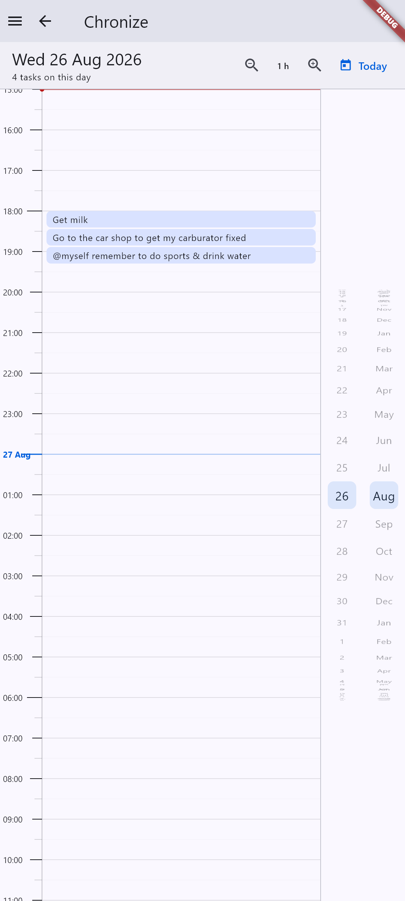

### Countdown Page

### Food Diary Page

### Home Page

### Menu Open

### Project Board Page

### Project Edit Dialog

### Projects Page

### Search Active

### Settings Page

### Settings Section Appearance

### Settings Section Backup

### Settings Section Dice Timer

### Settings Section Filtering Rules

### Settings Section Mode Features

### Settings Section Notifications

### Settings Section Sms Report

### Settings Section Streak

### Settings Section Sync Export

### Settings Section Tasks

### Settings Section Todoist Sync

### Settings Section Updates

### Settings Section Widget

### Task Open No Attachment

### Task Open With Attachment

### Test Results Page

### Usage Data Page

### Weekly Hours Planner Page

### Widget Previews Page

### Wishlist Page

### Your Stats Page

---

---

## 2026.08.26 16:50:26 | branch: dev v0.1.286+286 | source: 810b919

- Folder: `docs/screenshots/home/20260826-145025-810b919`

### Alarms Page

### Archived Items Page

### Chronize Page
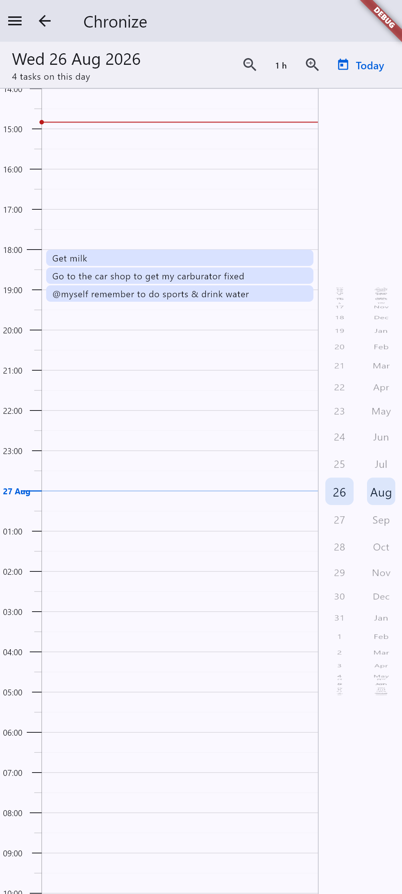

### Countdown Page

### Food Diary Page

### Home Page

### Menu Open

### Project Board Page

### Project Edit Dialog

### Projects Page

### Search Active

### Settings Page

### Settings Section Appearance

### Settings Section Backup

### Settings Section Dice Timer

### Settings Section Filtering Rules

### Settings Section Mode Features

### Settings Section Notifications

### Settings Section Sms Report

### Settings Section Streak

### Settings Section Sync Export

### Settings Section Tasks

### Settings Section Todoist Sync

### Settings Section Updates

### Settings Section Widget

### Task Open No Attachment

### Task Open With Attachment

### Test Results Page
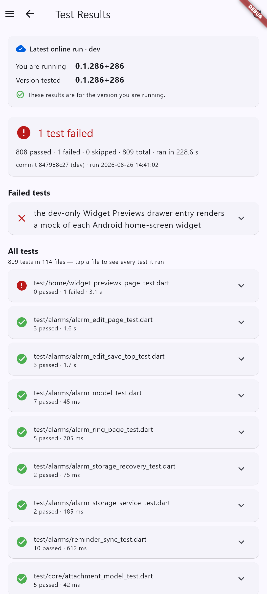

### Usage Data Page

### Weekly Hours Planner Page

### Widget Previews Page

### Wishlist Page

### Your Stats Page

---

---

## 2026.08.26 16:40:28 | branch: dev v0.1.286+286 | source: 847988c

- Folder: `docs/screenshots/home/20260826-144027-847988c`

### Alarms Page

### Archived Items Page

### Chronize Page
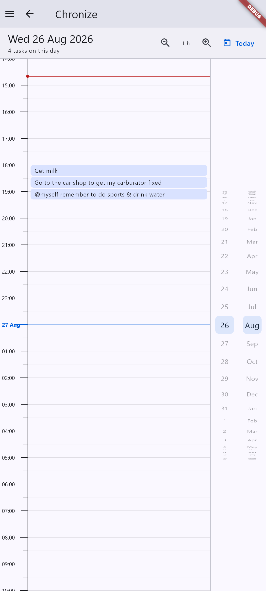

### Countdown Page

### Food Diary Page

### Home Page

### Menu Open

### Project Board Page

### Project Edit Dialog

### Projects Page

### Search Active

### Settings Page

### Settings Section Appearance

### Settings Section Backup

### Settings Section Dice Timer

### Settings Section Filtering Rules

### Settings Section Mode Features

### Settings Section Notifications

### Settings Section Sms Report

### Settings Section Streak

### Settings Section Sync Export

### Settings Section Tasks

### Settings Section Todoist Sync

### Settings Section Updates

### Settings Section Widget

### Task Open No Attachment

### Task Open With Attachment

### Test Results Page
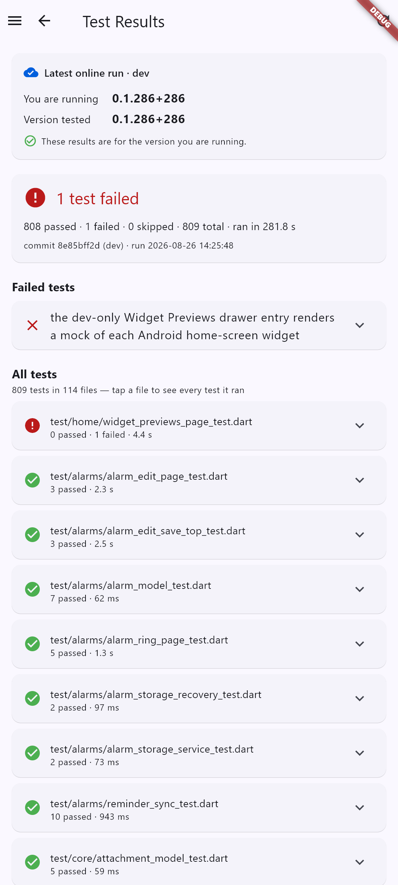

### Usage Data Page

### Weekly Hours Planner Page

### Widget Previews Page

### Wishlist Page

### Your Stats Page

---

---

## 2026.08.26 16:31:20 | branch: dev v0.1.286+286 | source: 51c5001

- Folder: `docs/screenshots/home/20260826-143119-51c5001`

### Alarms Page

### Archived Items Page

### Chronize Page
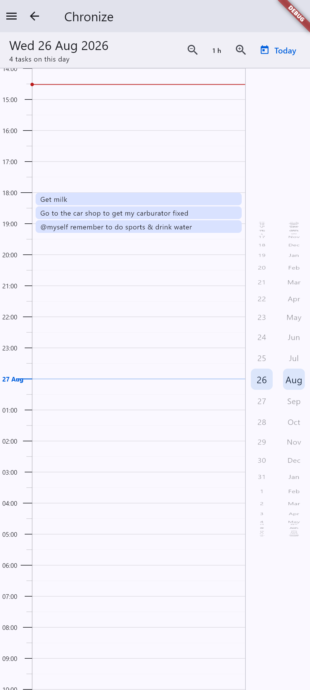

### Countdown Page

### Food Diary Page

### Home Page

### Menu Open

### Project Board Page

### Project Edit Dialog

### Projects Page

### Search Active

### Settings Page

### Settings Section Appearance

### Settings Section Backup

### Settings Section Dice Timer

### Settings Section Filtering Rules

### Settings Section Mode Features

### Settings Section Notifications

### Settings Section Sms Report

### Settings Section Streak

### Settings Section Sync Export

### Settings Section Tasks

### Settings Section Todoist Sync

### Settings Section Updates

### Settings Section Widget

### Task Open No Attachment

### Task Open With Attachment

### Test Results Page

### Usage Data Page

### Weekly Hours Planner Page

### Widget Previews Page

### Wishlist Page

### Your Stats Page

---

---

## 2026.08.26 16:20:16 | branch: dev v0.1.286+286 | source: 8e85bff

- Folder: `docs/screenshots/home/20260826-142015-8e85bff`

### Alarms Page

### Archived Items Page

### Chronize Page
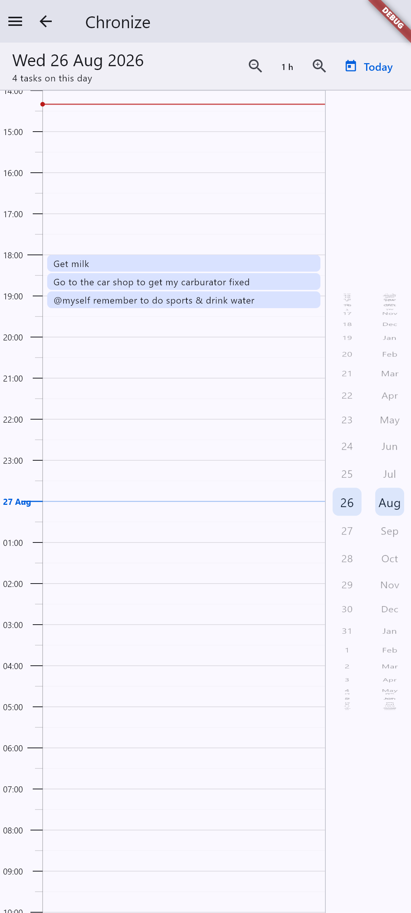

### Countdown Page

### Food Diary Page

### Home Page

### Menu Open

### Project Board Page

### Project Edit Dialog

### Projects Page

### Search Active

### Settings Page

### Settings Section Appearance

### Settings Section Backup

### Settings Section Dice Timer

### Settings Section Filtering Rules

### Settings Section Mode Features

### Settings Section Notifications

### Settings Section Sms Report

### Settings Section Streak

### Settings Section Sync Export

### Settings Section Tasks

### Settings Section Todoist Sync

### Settings Section Updates

### Settings Section Widget

### Task Open No Attachment

### Task Open With Attachment

### Test Results Page

### Usage Data Page

### Weekly Hours Planner Page

### Widget Previews Page

### Wishlist Page

### Your Stats Page

---

---

## 2026.08.26 16:11:14 | branch: dev v0.1.286+286 | source: 36de5ab

- Folder: `docs/screenshots/home/20260826-141113-36de5ab`

### Alarms Page

### Archived Items Page

### Chronize Page
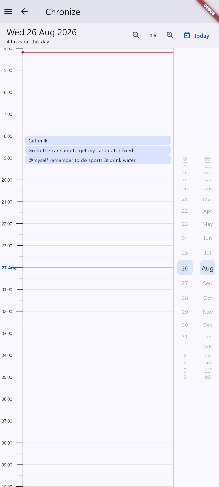

### Countdown Page

### Food Diary Page

### Home Page

### Menu Open

### Project Board Page

### Project Edit Dialog

### Projects Page

### Search Active

### Settings Page

### Settings Section Appearance

### Settings Section Backup

### Settings Section Dice Timer

### Settings Section Filtering Rules

### Settings Section Mode Features

### Settings Section Notifications

### Settings Section Sms Report

### Settings Section Streak

### Settings Section Sync Export

### Settings Section Tasks

### Settings Section Todoist Sync

### Settings Section Updates

### Settings Section Widget

### Task Open No Attachment

### Task Open With Attachment

### Test Results Page

### Usage Data Page

### Weekly Hours Planner Page

### Widget Previews Page

### Wishlist Page

### Your Stats Page

---

---

## 2026.08.26 16:01:30 | branch: dev v0.1.286+286 | source: 0d67787

- Folder: `docs/screenshots/home/20260826-140129-0d67787`

### Alarms Page

### Archived Items Page

### Chronize Page
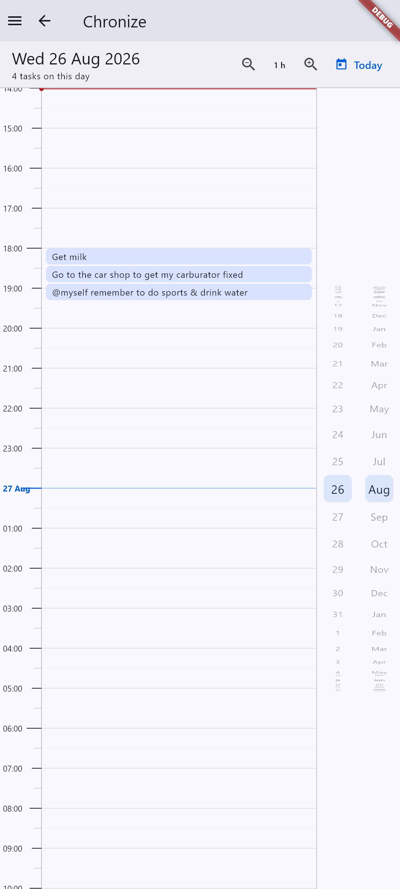

### Countdown Page

### Food Diary Page

### Home Page

### Menu Open

### Project Board Page

### Project Edit Dialog

### Projects Page

### Search Active

### Settings Page

### Settings Section Appearance

### Settings Section Backup

### Settings Section Dice Timer

### Settings Section Filtering Rules

### Settings Section Mode Features

### Settings Section Notifications

### Settings Section Sms Report

### Settings Section Streak

### Settings Section Sync Export
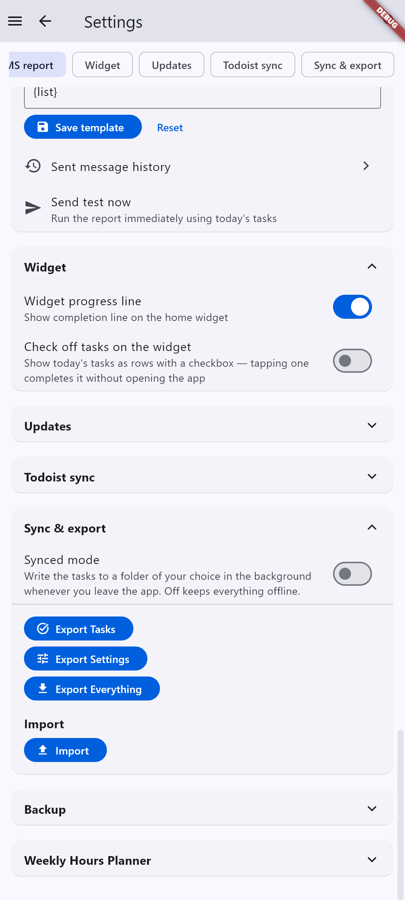

### Settings Section Tasks

### Settings Section Todoist Sync

### Settings Section Updates

### Settings Section Widget

### Task Open No Attachment

### Task Open With Attachment

### Test Results Page

### Usage Data Page

### Weekly Hours Planner Page

### Widget Previews Page

### Wishlist Page

### Your Stats Page

---

---

## 2026.08.26 15:52:02 | branch: dev v0.1.286+286 | source: 778bd3e

- Folder: `docs/screenshots/home/20260826-135201-778bd3e`

### Alarms Page

### Archived Items Page

### Chronize Page

### Countdown Page

### Food Diary Page

### Home Page

### Menu Open

### Project Board Page

### Project Edit Dialog

### Projects Page

### Search Active

### Settings Page

### Settings Section Appearance

### Settings Section Backup

### Settings Section Dice Timer

### Settings Section Filtering Rules

### Settings Section Mode Features

### Settings Section Notifications

### Settings Section Sms Report

### Settings Section Streak

### Settings Section Sync Export

### Settings Section Tasks

### Settings Section Todoist Sync

### Settings Section Updates

### Settings Section Widget

### Task Open No Attachment

### Task Open With Attachment

### Test Results Page

### Usage Data Page

### Weekly Hours Planner Page

### Widget Previews Page

### Wishlist Page

### Your Stats Page

---

---

## 2026.08.26 15:40:24 | branch: dev v0.1.286+286 | source: 0bb6a41

- Folder: `docs/screenshots/home/20260826-134023-0bb6a41`

### Alarms Page

### Archived Items Page

### Chronize Page
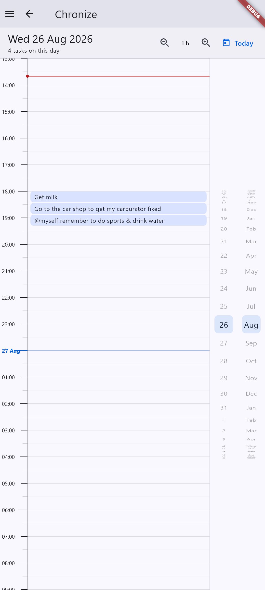

### Countdown Page
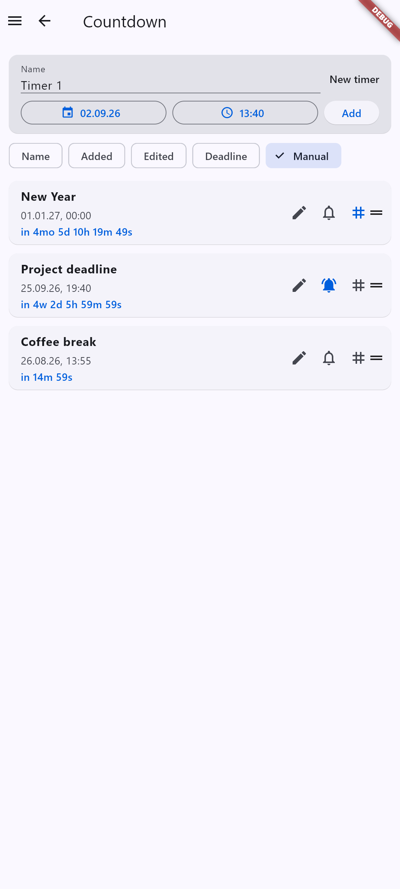

### Food Diary Page

### Home Page

### Menu Open

### Project Board Page

### Project Edit Dialog

### Projects Page

### Search Active

### Settings Page

### Settings Section Appearance

### Settings Section Backup

### Settings Section Dice Timer

### Settings Section Filtering Rules

### Settings Section Mode Features

### Settings Section Notifications

### Settings Section Sms Report

### Settings Section Streak

### Settings Section Sync Export

### Settings Section Tasks

### Settings Section Todoist Sync

### Settings Section Updates

### Settings Section Widget

### Task Open No Attachment

### Task Open With Attachment

### Test Results Page

### Usage Data Page

### Weekly Hours Planner Page

### Widget Previews Page

### Wishlist Page

### Your Stats Page

---

---

## 2026.08.26 15:30:47 | branch: dev v0.1.286+286 | source: e459bd0

- Folder: `docs/screenshots/home/20260826-133047-e459bd0`

### Alarms Page

### Archived Items Page

### Chronize Page
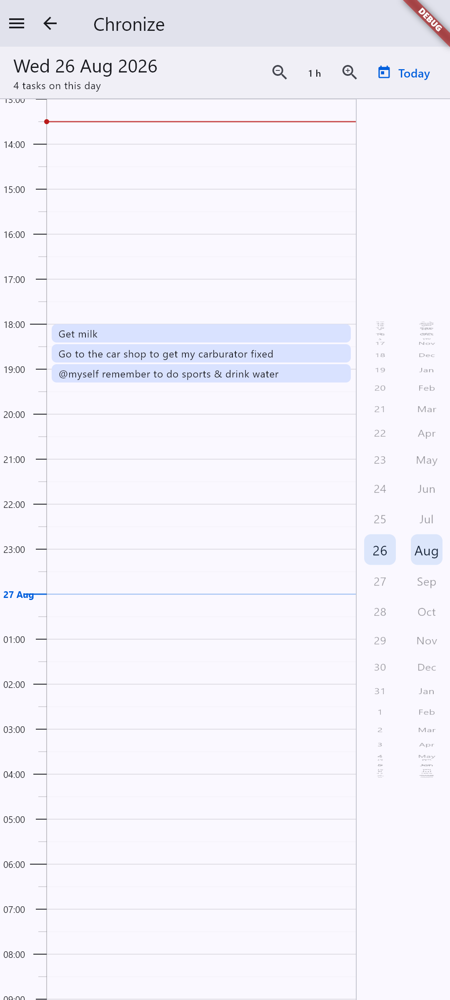

### Countdown Page

### Food Diary Page

### Home Page

### Menu Open

### Project Board Page

### Project Edit Dialog

### Projects Page

### Search Active

### Settings Page

### Settings Section Appearance

### Settings Section Backup

### Settings Section Dice Timer

### Settings Section Filtering Rules

### Settings Section Mode Features

### Settings Section Notifications
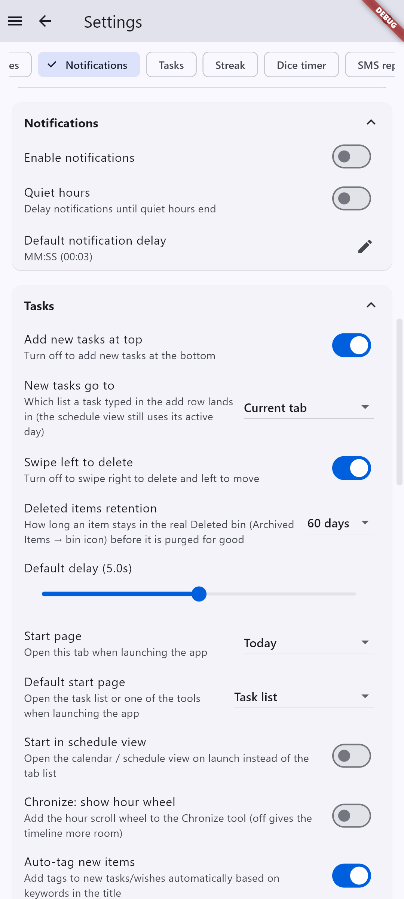

### Settings Section Sms Report

### Settings Section Streak

### Settings Section Sync Export

### Settings Section Tasks

### Settings Section Todoist Sync

### Settings Section Updates

### Settings Section Widget

### Task Open No Attachment

### Task Open With Attachment

### Test Results Page

### Usage Data Page

### Weekly Hours Planner Page

### Widget Previews Page

### Wishlist Page

### Your Stats Page

---

---

## 2026.08.26 15:21:30 | branch: dev v0.1.286+286 | source: aed3e94

- Folder: `docs/screenshots/home/20260826-132129-aed3e94`

### Alarms Page

### Archived Items Page

### Chronize Page
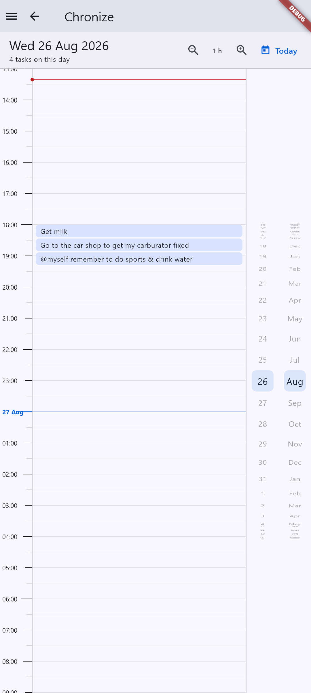

### Countdown Page

### Food Diary Page

### Home Page

### Menu Open

### Project Board Page

### Project Edit Dialog

### Projects Page

### Search Active

### Settings Page

### Settings Section Appearance

### Settings Section Backup

### Settings Section Dice Timer

### Settings Section Filtering Rules

### Settings Section Mode Features

### Settings Section Notifications

### Settings Section Sms Report

### Settings Section Streak

### Settings Section Sync Export

### Settings Section Tasks

### Settings Section Todoist Sync

### Settings Section Updates

### Settings Section Widget

### Task Open No Attachment

### Task Open With Attachment

### Test Results Page

### Usage Data Page

### Weekly Hours Planner Page

### Widget Previews Page

### Wishlist Page

### Your Stats Page

---

---

## 2026.08.26 15:11:15 | branch: dev v0.1.286+286 | source: c24981f

- Folder: `docs/screenshots/home/20260826-131114-c24981f`

### Alarms Page

### Archived Items Page

### Chronize Page
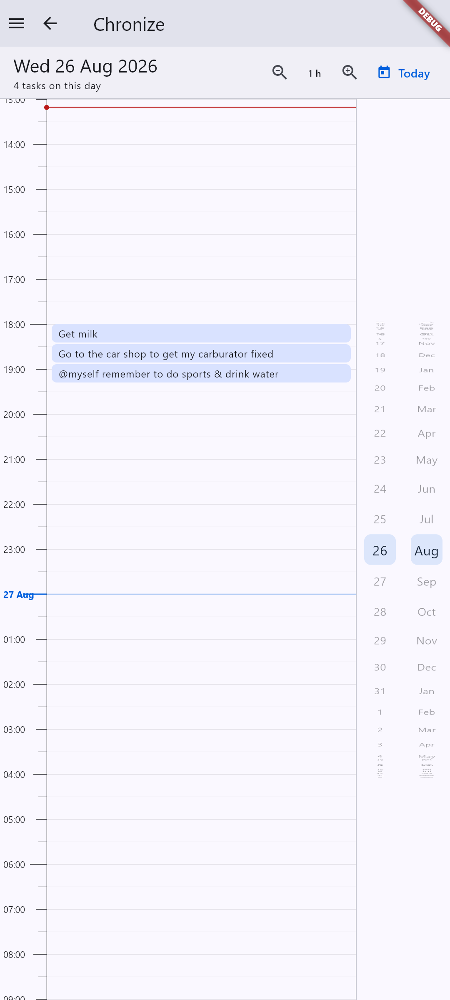

### Countdown Page

### Food Diary Page

### Home Page

### Menu Open

### Project Board Page

### Project Edit Dialog

### Projects Page

### Search Active

### Settings Page

### Settings Section Appearance

### Settings Section Backup

### Settings Section Dice Timer

### Settings Section Filtering Rules

### Settings Section Mode Features

### Settings Section Notifications

### Settings Section Sms Report

### Settings Section Streak

### Settings Section Sync Export

### Settings Section Tasks

### Settings Section Todoist Sync

### Settings Section Updates

### Settings Section Widget

### Task Open No Attachment

### Task Open With Attachment

### Test Results Page

### Usage Data Page

### Weekly Hours Planner Page

### Widget Previews Page

### Wishlist Page
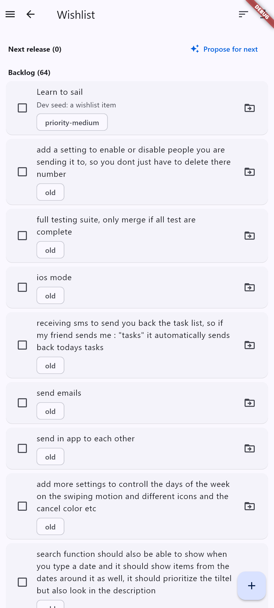

### Your Stats Page

---

---

## 2026.08.26 15:01:16 | branch: dev v0.1.286+286 | source: 6146a8c

- Folder: `docs/screenshots/home/20260826-130115-6146a8c`

### Alarms Page

### Archived Items Page

### Chronize Page

### Countdown Page

### Food Diary Page

### Home Page

### Menu Open
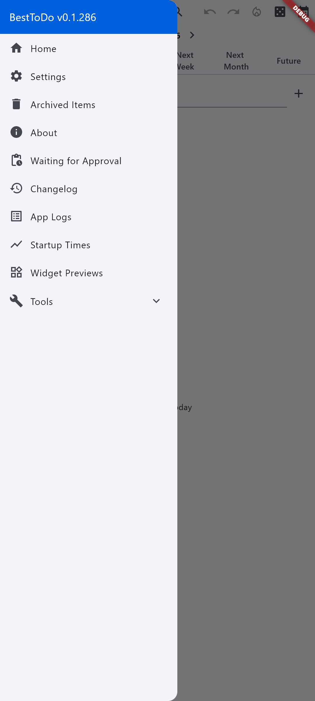

### Project Board Page

### Project Edit Dialog

### Projects Page

### Search Active

### Settings Page

### Settings Section Appearance

### Settings Section Backup

### Settings Section Dice Timer

### Settings Section Filtering Rules

### Settings Section Mode Features

### Settings Section Notifications

### Settings Section Sms Report

### Settings Section Streak

### Settings Section Sync Export

### Settings Section Tasks

### Settings Section Todoist Sync

### Settings Section Updates

### Settings Section Widget

### Task Open No Attachment

### Task Open With Attachment

### Test Results Page

### Usage Data Page

### Weekly Hours Planner Page

### Widget Previews Page

### Wishlist Page

### Your Stats Page

---

---

## 2026.08.26 14:50:20 | branch: dev v0.1.286+286 | source: d4d9144

- Folder: `docs/screenshots/home/20260826-125019-d4d9144`

### Alarms Page

### Archived Items Page

### Chronize Page
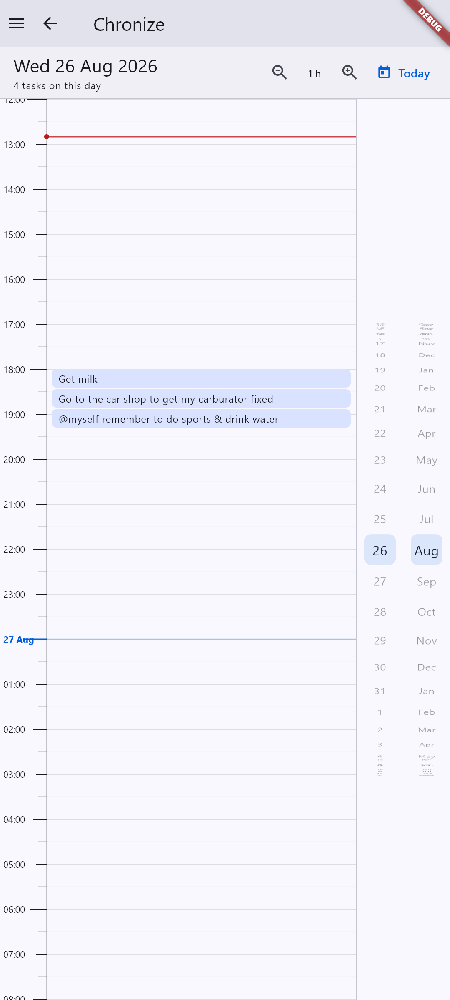

### Countdown Page

### Food Diary Page

### Home Page

### Menu Open

### Project Board Page

### Project Edit Dialog

### Projects Page

### Search Active

### Settings Page

### Settings Section Appearance

### Settings Section Backup

### Settings Section Dice Timer

### Settings Section Filtering Rules

### Settings Section Mode Features

### Settings Section Notifications

### Settings Section Sms Report

### Settings Section Streak

### Settings Section Sync Export

### Settings Section Tasks

### Settings Section Todoist Sync

### Settings Section Updates

### Settings Section Widget

### Task Open No Attachment

### Task Open With Attachment

### Test Results Page

### Usage Data Page

### Weekly Hours Planner Page

### Widget Previews Page

### Wishlist Page

### Your Stats Page

---

---

## 2026.08.26 14:41:06 | branch: dev v0.1.286+286 | source: 4c27e8d

- Folder: `docs/screenshots/home/20260826-124105-4c27e8d`

### Alarms Page

### Archived Items Page

### Chronize Page

### Countdown Page

### Food Diary Page

### Home Page

### Menu Open

### Project Board Page

### Project Edit Dialog

### Projects Page

### Search Active

### Settings Page

### Settings Section Appearance

### Settings Section Backup

### Settings Section Dice Timer

### Settings Section Filtering Rules

### Settings Section Mode Features

### Settings Section Notifications

### Settings Section Sms Report

### Settings Section Streak

### Settings Section Sync Export

### Settings Section Tasks

### Settings Section Todoist Sync

### Settings Section Updates

### Settings Section Widget

### Task Open No Attachment

### Task Open With Attachment

### Test Results Page

### Usage Data Page

### Weekly Hours Planner Page

### Widget Previews Page

### Wishlist Page

### Your Stats Page

---

---

## 2026.08.26 14:30:24 | branch: dev v0.1.286+286 | source: d2e6488

- Folder: `docs/screenshots/home/20260826-123023-d2e6488`

### Alarms Page

### Archived Items Page

### Chronize Page

### Countdown Page

### Food Diary Page

### Home Page

### Menu Open

### Project Board Page

### Project Edit Dialog

### Projects Page

### Search Active

### Settings Page

### Settings Section Appearance

### Settings Section Backup

### Settings Section Dice Timer

### Settings Section Filtering Rules

### Settings Section Mode Features

### Settings Section Notifications

### Settings Section Sms Report

### Settings Section Streak

### Settings Section Sync Export

### Settings Section Tasks

### Settings Section Todoist Sync

### Settings Section Updates

### Settings Section Widget

### Task Open No Attachment

### Task Open With Attachment

### Test Results Page

### Usage Data Page

### Weekly Hours Planner Page

### Widget Previews Page

### Wishlist Page

### Your Stats Page
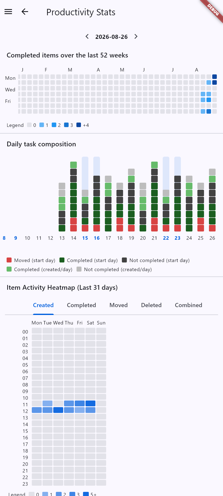

---

---

## 2026.08.26 14:20:14 | branch: dev v0.1.286+286 | source: 31886c4

- Folder: `docs/screenshots/home/20260826-122013-31886c4`

### Alarms Page

### Archived Items Page

### Chronize Page
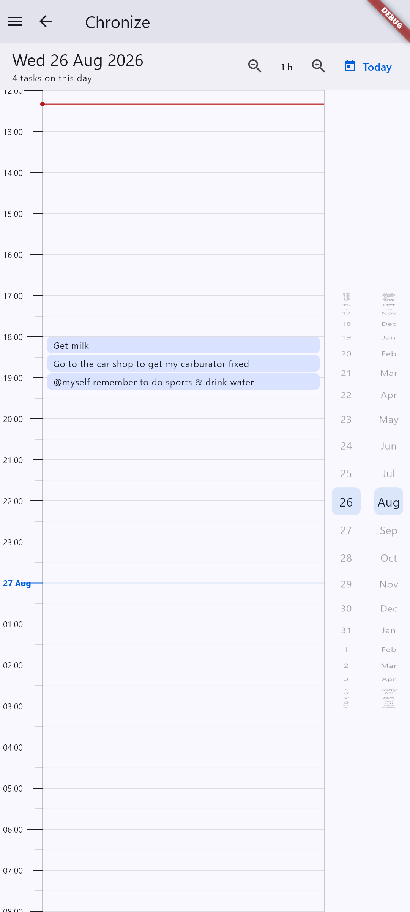

### Countdown Page

### Food Diary Page

### Home Page

### Menu Open

### Project Board Page

### Project Edit Dialog

### Projects Page

### Search Active

### Settings Page

### Settings Section Appearance

### Settings Section Backup

### Settings Section Dice Timer

### Settings Section Filtering Rules

### Settings Section Mode Features

### Settings Section Notifications

### Settings Section Sms Report

### Settings Section Streak

### Settings Section Sync Export

### Settings Section Tasks

### Settings Section Todoist Sync

### Settings Section Updates

### Settings Section Widget

### Task Open No Attachment

### Task Open With Attachment

### Test Results Page

### Usage Data Page

### Weekly Hours Planner Page

### Widget Previews Page

### Wishlist Page

### Your Stats Page

---

---

## 2026.08.26 14:10:17 | branch: dev v0.1.286+286 | source: 3a776c6

- Folder: `docs/screenshots/home/20260826-121016-3a776c6`

### Alarms Page

### Archived Items Page

### Chronize Page
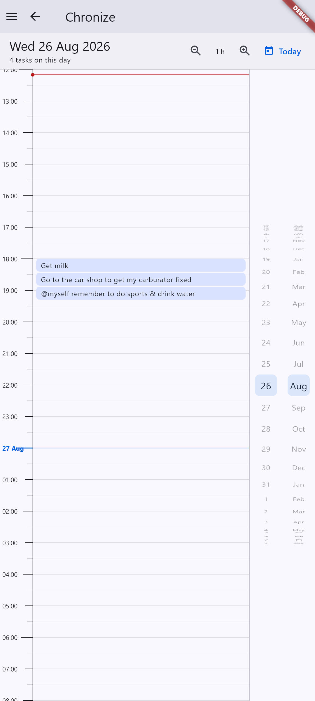

### Countdown Page

### Food Diary Page

### Home Page

### Menu Open

### Project Board Page

### Project Edit Dialog

### Projects Page

### Search Active

### Settings Page

### Settings Section Appearance

### Settings Section Backup

### Settings Section Dice Timer

### Settings Section Filtering Rules

### Settings Section Mode Features

### Settings Section Notifications

### Settings Section Sms Report

### Settings Section Streak

### Settings Section Sync Export

### Settings Section Tasks

### Settings Section Todoist Sync

### Settings Section Updates

### Settings Section Widget

### Task Open No Attachment

### Task Open With Attachment

### Test Results Page
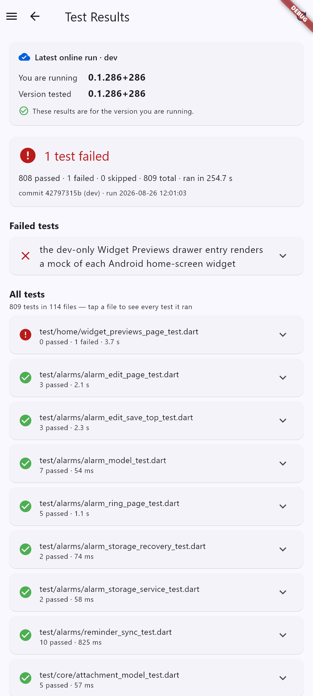

### Usage Data Page

### Weekly Hours Planner Page

### Widget Previews Page

### Wishlist Page

### Your Stats Page

---

---

## 2026.08.26 14:00:35 | branch: dev v0.1.286+286 | source: 4279731

- Folder: `docs/screenshots/home/20260826-120034-4279731`

### Alarms Page

### Archived Items Page

### Chronize Page


### Countdown Page

### Food Diary Page

### Home Page

### Menu Open

### Project Board Page

### Project Edit Dialog

### Projects Page

### Search Active

### Settings Page

### Settings Section Appearance

### Settings Section Backup

### Settings Section Dice Timer

### Settings Section Filtering Rules

### Settings Section Mode Features

### Settings Section Notifications

### Settings Section Sms Report

### Settings Section Streak

### Settings Section Sync Export

### Settings Section Tasks

### Settings Section Todoist Sync

### Settings Section Updates

### Settings Section Widget

### Task Open No Attachment

### Task Open With Attachment

### Test Results Page

### Usage Data Page

### Weekly Hours Planner Page

### Widget Previews Page

### Wishlist Page

### Your Stats Page

---

---

## 2026.08.26 13:50:31 | branch: dev v0.1.286+286 | source: 52f8121

- Folder: `docs/screenshots/home/20260826-115030-52f8121`

### Alarms Page

### Archived Items Page

### Chronize Page

### Countdown Page

### Food Diary Page

### Home Page

### Menu Open

### Project Board Page

### Project Edit Dialog

### Projects Page

### Search Active

### Settings Page

### Settings Section Appearance

### Settings Section Backup

### Settings Section Dice Timer

### Settings Section Filtering Rules

### Settings Section Mode Features

### Settings Section Notifications

### Settings Section Sms Report

### Settings Section Streak

### Settings Section Sync Export

### Settings Section Tasks

### Settings Section Todoist Sync

### Settings Section Updates

### Settings Section Widget

### Task Open No Attachment

### Task Open With Attachment

### Test Results Page

### Usage Data Page

### Weekly Hours Planner Page

### Widget Previews Page

### Wishlist Page

### Your Stats Page

---

---

## 2026.08.26 13:40:20 | branch: dev v0.1.286+286 | source: f6babce

- Folder: `docs/screenshots/home/20260826-114019-f6babce`

### Alarms Page

### Archived Items Page

### Chronize Page

### Countdown Page

### Food Diary Page

### Home Page

### Menu Open

### Project Board Page

### Project Edit Dialog

### Projects Page

### Search Active

### Settings Page

### Settings Section Appearance

### Settings Section Backup

### Settings Section Dice Timer

### Settings Section Filtering Rules

### Settings Section Mode Features

### Settings Section Notifications

### Settings Section Sms Report

### Settings Section Streak

### Settings Section Sync Export

### Settings Section Tasks

### Settings Section Todoist Sync

### Settings Section Updates

### Settings Section Widget

### Task Open No Attachment

### Task Open With Attachment

### Test Results Page

### Usage Data Page

### Weekly Hours Planner Page

### Widget Previews Page

### Wishlist Page

### Your Stats Page

---

---

## 2026.08.26 13:30:12 | branch: dev v0.1.286+286 | source: f90e316

- Folder: `docs/screenshots/home/20260826-113011-f90e316`

### Alarms Page

### Archived Items Page

### Chronize Page


### Countdown Page

### Food Diary Page

### Home Page

### Menu Open

### Project Board Page

### Project Edit Dialog

### Projects Page

### Search Active

### Settings Page

### Settings Section Appearance

### Settings Section Backup

### Settings Section Dice Timer

### Settings Section Filtering Rules

### Settings Section Mode Features

### Settings Section Notifications

### Settings Section Sms Report

### Settings Section Streak

### Settings Section Sync Export

### Settings Section Tasks

### Settings Section Todoist Sync

### Settings Section Updates

### Settings Section Widget

### Task Open No Attachment

### Task Open With Attachment

### Test Results Page


### Usage Data Page

### Weekly Hours Planner Page

### Widget Previews Page

### Wishlist Page

### Your Stats Page

---

---

## 2026.08.26 13:20:04 | branch: dev v0.1.286+286 | source: 497b83a

- Folder: `docs/screenshots/home/20260826-112004-497b83a`

### Alarms Page

### Archived Items Page

### Chronize Page

### Countdown Page

### Food Diary Page

### Home Page

### Menu Open

### Project Board Page

### Project Edit Dialog

### Projects Page

### Search Active

### Settings Page

### Settings Section Appearance

### Settings Section Backup

### Settings Section Dice Timer

### Settings Section Filtering Rules

### Settings Section Mode Features

### Settings Section Notifications

### Settings Section Sms Report

### Settings Section Streak

### Settings Section Sync Export

### Settings Section Tasks

### Settings Section Todoist Sync

### Settings Section Updates

### Settings Section Widget

### Task Open No Attachment

### Task Open With Attachment

### Test Results Page

### Usage Data Page

### Weekly Hours Planner Page

### Widget Previews Page

### Wishlist Page

### Your Stats Page

---

---

## 2026.08.26 13:10:59 | branch: dev v0.1.286+286 | source: e89645e

- Folder: `docs/screenshots/home/20260826-111058-e89645e`

### Alarms Page

### Archived Items Page

### Chronize Page

### Countdown Page

### Food Diary Page

### Home Page

### Menu Open

### Project Board Page

### Project Edit Dialog

### Projects Page

### Search Active

### Settings Page

### Settings Section Appearance

### Settings Section Backup

### Settings Section Dice Timer

### Settings Section Filtering Rules

### Settings Section Mode Features

### Settings Section Notifications

### Settings Section Sms Report

### Settings Section Streak

### Settings Section Sync Export

### Settings Section Tasks

### Settings Section Todoist Sync

### Settings Section Updates

### Settings Section Widget

### Task Open No Attachment

### Task Open With Attachment

### Test Results Page

### Usage Data Page

### Weekly Hours Planner Page

### Widget Previews Page

### Wishlist Page

### Your Stats Page

---

---

## 2026.08.26 13:00:19 | branch: dev v0.1.286+286 | source: 8e53ec6

- Folder: `docs/screenshots/home/20260826-110018-8e53ec6`

### Alarms Page

### Archived Items Page

### Chronize Page


### Countdown Page

### Food Diary Page

### Home Page

### Menu Open

### Project Board Page

### Project Edit Dialog

### Projects Page

### Search Active

### Settings Page

### Settings Section Appearance

### Settings Section Backup

### Settings Section Dice Timer

### Settings Section Filtering Rules

### Settings Section Mode Features

### Settings Section Notifications

### Settings Section Sms Report

### Settings Section Streak

### Settings Section Sync Export

### Settings Section Tasks

### Settings Section Todoist Sync

### Settings Section Updates

### Settings Section Widget

### Task Open No Attachment

### Task Open With Attachment

### Test Results Page

### Usage Data Page

### Weekly Hours Planner Page

### Widget Previews Page

### Wishlist Page

### Your Stats Page

---

---

## 2026.08.26 12:50:24 | branch: dev v0.1.286+286 | source: c2a4ffb

- Folder: `docs/screenshots/home/20260826-105023-c2a4ffb`

### Alarms Page

### Archived Items Page

### Chronize Page


### Countdown Page

### Food Diary Page

### Home Page

### Menu Open

### Project Board Page

### Project Edit Dialog

### Projects Page

### Search Active

### Settings Page

### Settings Section Appearance

### Settings Section Backup

### Settings Section Dice Timer

### Settings Section Filtering Rules

### Settings Section Mode Features

### Settings Section Notifications

### Settings Section Sms Report

### Settings Section Streak

### Settings Section Sync Export

### Settings Section Tasks

### Settings Section Todoist Sync

### Settings Section Updates

### Settings Section Widget

### Task Open No Attachment

### Task Open With Attachment

### Test Results Page

### Usage Data Page

### Weekly Hours Planner Page

### Widget Previews Page

### Wishlist Page

### Your Stats Page

---

---

## 2026.08.26 12:40:14 | branch: dev v0.1.286+286 | source: ba00e32

- Folder: `docs/screenshots/home/20260826-104013-ba00e32`

### Alarms Page

### Archived Items Page

### Chronize Page


### Countdown Page

### Food Diary Page

### Home Page

### Menu Open

### Project Board Page

### Project Edit Dialog

### Projects Page

### Search Active

### Settings Page

### Settings Section Appearance

### Settings Section Backup

### Settings Section Dice Timer

### Settings Section Filtering Rules

### Settings Section Mode Features

### Settings Section Notifications

### Settings Section Sms Report

### Settings Section Streak

### Settings Section Sync Export

### Settings Section Tasks

### Settings Section Todoist Sync

### Settings Section Updates

### Settings Section Widget

### Task Open No Attachment

### Task Open With Attachment

### Test Results Page

### Usage Data Page

### Weekly Hours Planner Page

### Widget Previews Page

### Wishlist Page

### Your Stats Page

---

---

## 2026.08.26 12:30:49 | branch: dev v0.1.286+286 | source: 2bc0712

- Folder: `docs/screenshots/home/20260826-103049-2bc0712`

### Alarms Page

### Archived Items Page

### Chronize Page


### Countdown Page

### Food Diary Page

### Home Page

### Menu Open

### Project Board Page

### Project Edit Dialog

### Projects Page

### Search Active

### Settings Page

### Settings Section Appearance

### Settings Section Backup

### Settings Section Dice Timer

### Settings Section Filtering Rules

### Settings Section Mode Features

### Settings Section Notifications

### Settings Section Sms Report

### Settings Section Streak

### Settings Section Sync Export

### Settings Section Tasks

### Settings Section Todoist Sync

### Settings Section Updates

### Settings Section Widget

### Task Open No Attachment

### Task Open With Attachment

### Test Results Page

### Usage Data Page

### Weekly Hours Planner Page

### Widget Previews Page

### Wishlist Page

### Your Stats Page

---

---

## 2026.08.26 12:20:19 | branch: dev v0.1.286+286 | source: 4d10ca7

- Folder: `docs/screenshots/home/20260826-102018-4d10ca7`

### Alarms Page

### Archived Items Page

### Chronize Page


### Countdown Page

### Food Diary Page

### Home Page

### Menu Open

### Project Board Page

### Project Edit Dialog

### Projects Page

### Search Active

### Settings Page

### Settings Section Appearance

### Settings Section Backup

### Settings Section Dice Timer

### Settings Section Filtering Rules

### Settings Section Mode Features

### Settings Section Notifications

### Settings Section Sms Report

### Settings Section Streak

### Settings Section Sync Export

### Settings Section Tasks

### Settings Section Todoist Sync

### Settings Section Updates

### Settings Section Widget

### Task Open No Attachment

### Task Open With Attachment

### Test Results Page

### Usage Data Page

### Weekly Hours Planner Page

### Widget Previews Page

### Wishlist Page

### Your Stats Page

---

---

## 2026.08.26 12:10:34 | branch: dev v0.1.286+286 | source: fd20ace

- Folder: `docs/screenshots/home/20260826-101033-fd20ace`

### Alarms Page

### Archived Items Page

### Chronize Page

### Countdown Page

### Food Diary Page

### Home Page

### Menu Open

### Project Board Page

### Project Edit Dialog

### Projects Page

### Search Active

### Settings Page

### Settings Section Appearance

### Settings Section Backup

### Settings Section Dice Timer

### Settings Section Filtering Rules

### Settings Section Mode Features

### Settings Section Notifications

### Settings Section Sms Report

### Settings Section Streak

### Settings Section Sync Export

### Settings Section Tasks

### Settings Section Todoist Sync

### Settings Section Updates

### Settings Section Widget

### Task Open No Attachment

### Task Open With Attachment

### Test Results Page

### Usage Data Page

### Weekly Hours Planner Page

### Widget Previews Page

### Wishlist Page

### Your Stats Page

---

---

## 2026.08.26 12:00:37 | branch: dev v0.1.286+286 | source: 99d83c9

- Folder: `docs/screenshots/home/20260826-100036-99d83c9`

### Alarms Page

### Archived Items Page

### Chronize Page


### Countdown Page

### Food Diary Page

### Home Page

### Menu Open

### Project Board Page

### Project Edit Dialog

### Projects Page

### Search Active

### Settings Page

### Settings Section Appearance

### Settings Section Backup

### Settings Section Dice Timer

### Settings Section Filtering Rules

### Settings Section Mode Features

### Settings Section Notifications

### Settings Section Sms Report

### Settings Section Streak

### Settings Section Sync Export

### Settings Section Tasks

### Settings Section Todoist Sync

### Settings Section Updates

### Settings Section Widget


### Task Open No Attachment


### Task Open With Attachment

### Test Results Page

### Usage Data Page

### Weekly Hours Planner Page

### Widget Previews Page

### Wishlist Page

### Your Stats Page

---

---

## 2026.08.26 11:50:22 | branch: dev v0.1.286+286 | source: 03a753f

- Folder: `docs/screenshots/home/20260826-095021-03a753f`

### Alarms Page

### Archived Items Page

### Chronize Page


### Countdown Page

### Food Diary Page

### Home Page

### Menu Open

### Project Board Page

### Project Edit Dialog

### Projects Page

### Search Active

### Settings Page

### Settings Section Appearance

### Settings Section Backup

### Settings Section Dice Timer

### Settings Section Filtering Rules

### Settings Section Mode Features

### Settings Section Notifications

### Settings Section Sms Report

### Settings Section Streak

### Settings Section Sync Export

### Settings Section Tasks

### Settings Section Todoist Sync

### Settings Section Updates

### Settings Section Widget

### Task Open No Attachment

### Task Open With Attachment


### Test Results Page

### Usage Data Page

### Weekly Hours Planner Page


### Widget Previews Page

### Wishlist Page

### Your Stats Page

---

---

## 2026.08.26 11:40:14 | branch: dev v0.1.286+286 | source: db79add

- Folder: `docs/screenshots/home/20260826-094013-db79add`

### Alarms Page

### Archived Items Page

### Chronize Page

### Countdown Page

### Food Diary Page

### Home Page

### Menu Open

### Project Board Page

### Project Edit Dialog

### Projects Page

### Search Active

### Settings Page

### Settings Section Appearance

### Settings Section Backup

### Settings Section Dice Timer

### Settings Section Filtering Rules

### Settings Section Mode Features

### Settings Section Notifications

### Settings Section Sms Report

### Settings Section Streak

### Settings Section Sync Export

### Settings Section Tasks

### Settings Section Todoist Sync

### Settings Section Updates

### Settings Section Widget

### Task Open No Attachment

### Task Open With Attachment

### Test Results Page

### Usage Data Page

### Weekly Hours Planner Page

### Widget Previews Page

### Wishlist Page

### Your Stats Page

---

---

## 2026.08.26 11:30:38 | branch: dev v0.1.286+286 | source: fcc7b98

- Folder: `docs/screenshots/home/20260826-093038-fcc7b98`

### Alarms Page

### Archived Items Page

### Chronize Page


### Countdown Page

### Food Diary Page

### Home Page

### Menu Open

### Project Board Page

### Project Edit Dialog

### Projects Page

### Search Active

### Settings Page

### Settings Section Appearance

### Settings Section Backup

### Settings Section Dice Timer

### Settings Section Filtering Rules

### Settings Section Mode Features

### Settings Section Notifications

### Settings Section Sms Report

### Settings Section Streak

### Settings Section Sync Export

### Settings Section Tasks

### Settings Section Todoist Sync

### Settings Section Updates

### Settings Section Widget

### Task Open No Attachment

### Task Open With Attachment

### Test Results Page

### Usage Data Page

### Weekly Hours Planner Page

### Widget Previews Page

### Wishlist Page

### Your Stats Page

---

---

## 2026.08.26 11:20:36 | branch: dev v0.1.286+286 | source: a5a275a

- Folder: `docs/screenshots/home/20260826-092035-a5a275a`

### Alarms Page

### Archived Items Page

### Chronize Page


### Countdown Page

### Food Diary Page

### Home Page

### Menu Open

### Project Board Page

### Project Edit Dialog

### Projects Page

### Search Active

### Settings Page

### Settings Section Appearance

### Settings Section Backup

### Settings Section Dice Timer

### Settings Section Filtering Rules

### Settings Section Mode Features

### Settings Section Notifications

### Settings Section Sms Report

### Settings Section Streak

### Settings Section Sync Export

### Settings Section Tasks

### Settings Section Todoist Sync

### Settings Section Updates

### Settings Section Widget

### Task Open No Attachment

### Task Open With Attachment

### Test Results Page

### Usage Data Page

### Weekly Hours Planner Page

### Widget Previews Page

### Wishlist Page

### Your Stats Page

---

---

## 2026.08.26 11:11:11 | branch: dev v0.1.286+286 | source: d123b9d

- Folder: `docs/screenshots/home/20260826-091110-d123b9d`

### Alarms Page

### Archived Items Page

### Chronize Page

### Countdown Page


### Food Diary Page

### Home Page

### Menu Open

### Project Board Page

### Project Edit Dialog

### Projects Page

### Search Active

### Settings Page

### Settings Section Appearance

### Settings Section Backup

### Settings Section Dice Timer

### Settings Section Filtering Rules

### Settings Section Mode Features

### Settings Section Notifications

### Settings Section Sms Report

### Settings Section Streak


### Settings Section Sync Export

### Settings Section Tasks

### Settings Section Todoist Sync

### Settings Section Updates

### Settings Section Widget

### Task Open No Attachment

### Task Open With Attachment

### Test Results Page

### Usage Data Page

### Weekly Hours Planner Page

### Widget Previews Page

### Wishlist Page

### Your Stats Page

---

---

## 2026.08.26 11:00:19 | branch: dev v0.1.286+286 | source: 4e44a1e

- Folder: `docs/screenshots/home/20260826-090018-4e44a1e`

### Alarms Page

### Archived Items Page

### Chronize Page


### Countdown Page

### Food Diary Page

### Home Page

### Menu Open

### Project Board Page

### Project Edit Dialog

### Projects Page

### Search Active

### Settings Page

### Settings Section Appearance

### Settings Section Backup

### Settings Section Dice Timer

### Settings Section Filtering Rules

### Settings Section Mode Features

### Settings Section Notifications

### Settings Section Sms Report

### Settings Section Streak

### Settings Section Sync Export

### Settings Section Tasks

### Settings Section Todoist Sync

### Settings Section Updates

### Settings Section Widget

### Task Open No Attachment

### Task Open With Attachment

### Test Results Page

### Usage Data Page

### Weekly Hours Planner Page

### Widget Previews Page

### Wishlist Page

### Your Stats Page

---

---

## 2026.08.26 10:50:23 | branch: dev v0.1.286+286 | source: edf6431

- Folder: `docs/screenshots/home/20260826-085022-edf6431`

### Alarms Page

### Archived Items Page

### Chronize Page


### Countdown Page

### Food Diary Page

### Home Page

### Menu Open

### Project Board Page

### Project Edit Dialog

### Projects Page

### Search Active

### Settings Page

### Settings Section Appearance

### Settings Section Backup

### Settings Section Dice Timer

### Settings Section Filtering Rules

### Settings Section Mode Features

### Settings Section Notifications

### Settings Section Sms Report

### Settings Section Streak

### Settings Section Sync Export

### Settings Section Tasks

### Settings Section Todoist Sync

### Settings Section Updates

### Settings Section Widget

### Task Open No Attachment

### Task Open With Attachment

### Test Results Page

### Usage Data Page

### Weekly Hours Planner Page

### Widget Previews Page

### Wishlist Page

### Your Stats Page

---

---

## 2026.08.26 10:39:11 | branch: dev v0.1.286+286 | source: f47d729

- Folder: `docs/screenshots/home/20260826-083910-f47d729`

### Alarms Page

### Archived Items Page

### Chronize Page

### Countdown Page

### Food Diary Page

### Home Page

### Menu Open

### Project Board Page

### Project Edit Dialog

### Projects Page

### Search Active

### Settings Page

### Settings Section Appearance

### Settings Section Backup

### Settings Section Dice Timer

### Settings Section Filtering Rules

### Settings Section Mode Features

### Settings Section Notifications

### Settings Section Sms Report


### Settings Section Streak

### Settings Section Sync Export

### Settings Section Tasks

### Settings Section Todoist Sync

### Settings Section Updates

### Settings Section Widget

### Task Open No Attachment

### Task Open With Attachment

### Test Results Page


### Usage Data Page

### Weekly Hours Planner Page

### Widget Previews Page

### Wishlist Page

### Your Stats Page

---

---

## 2026.08.26 10:30:31 | branch: dev v0.1.286+286 | source: 0ff9a79

- Folder: `docs/screenshots/home/20260826-083030-0ff9a79`

### Alarms Page

### Archived Items Page

### Chronize Page


### Countdown Page

### Food Diary Page

### Home Page

### Menu Open

### Project Board Page

### Project Edit Dialog

### Projects Page

### Search Active

### Settings Page

### Settings Section Appearance

### Settings Section Backup

### Settings Section Dice Timer

### Settings Section Filtering Rules

### Settings Section Mode Features

### Settings Section Notifications

### Settings Section Sms Report

### Settings Section Streak

### Settings Section Sync Export

### Settings Section Tasks

### Settings Section Todoist Sync

### Settings Section Updates

### Settings Section Widget

### Task Open No Attachment

### Task Open With Attachment

### Test Results Page

### Usage Data Page

### Weekly Hours Planner Page

### Widget Previews Page

### Wishlist Page

### Your Stats Page

---

---

## 2026.08.26 10:20:29 | branch: dev v0.1.286+286 | source: 905966a

- Folder: `docs/screenshots/home/20260826-082029-905966a`

### Alarms Page

### Archived Items Page

### Chronize Page


### Countdown Page

### Food Diary Page

### Home Page

### Menu Open

### Project Board Page

### Project Edit Dialog

### Projects Page

### Search Active

### Settings Page

### Settings Section Appearance

### Settings Section Backup

### Settings Section Dice Timer

### Settings Section Filtering Rules

### Settings Section Mode Features

### Settings Section Notifications

### Settings Section Sms Report

### Settings Section Streak

### Settings Section Sync Export

### Settings Section Tasks

### Settings Section Todoist Sync

### Settings Section Updates

### Settings Section Widget

### Task Open No Attachment

### Task Open With Attachment

### Test Results Page

### Usage Data Page

### Weekly Hours Planner Page

### Widget Previews Page

### Wishlist Page

### Your Stats Page

---

---

## 2026.08.26 10:10:29 | branch: dev v0.1.286+286 | source: 8cf7b58

- Folder: `docs/screenshots/home/20260826-081028-8cf7b58`

### Alarms Page

### Archived Items Page

### Chronize Page


### Countdown Page

### Food Diary Page

### Home Page

### Menu Open

### Project Board Page

### Project Edit Dialog

### Projects Page

### Search Active

### Settings Page

### Settings Section Appearance

### Settings Section Backup

### Settings Section Dice Timer

### Settings Section Filtering Rules

### Settings Section Mode Features

### Settings Section Notifications

### Settings Section Sms Report

### Settings Section Streak

### Settings Section Sync Export

### Settings Section Tasks

### Settings Section Todoist Sync

### Settings Section Updates


### Settings Section Widget

### Task Open No Attachment

### Task Open With Attachment

### Test Results Page

### Usage Data Page

### Weekly Hours Planner Page

### Widget Previews Page

### Wishlist Page

### Your Stats Page

---

---

## 2026.08.26 10:00:13 | branch: dev v0.1.286+286 | source: 8c2f2bc

- Folder: `docs/screenshots/home/20260826-080012-8c2f2bc`

### Alarms Page

### Archived Items Page

### Chronize Page


### Countdown Page

### Food Diary Page

### Home Page

### Menu Open

### Project Board Page

### Project Edit Dialog

### Projects Page

### Search Active

### Settings Page

### Settings Section Appearance

### Settings Section Backup

### Settings Section Dice Timer

### Settings Section Filtering Rules

### Settings Section Mode Features

### Settings Section Notifications

### Settings Section Sms Report

### Settings Section Streak

### Settings Section Sync Export

### Settings Section Tasks

### Settings Section Todoist Sync

### Settings Section Updates

### Settings Section Widget

### Task Open No Attachment

### Task Open With Attachment

### Test Results Page

### Usage Data Page

### Weekly Hours Planner Page

### Widget Previews Page

### Wishlist Page

### Your Stats Page

---

---

## 2026.08.26 09:50:39 | branch: dev v0.1.286+286 | source: 0dbbb44

- Folder: `docs/screenshots/home/20260826-075038-0dbbb44`

### Alarms Page

### Archived Items Page

### Chronize Page

### Countdown Page

### Food Diary Page


### Home Page

### Menu Open

### Project Board Page

### Project Edit Dialog

### Projects Page

### Search Active

### Settings Page

### Settings Section Appearance

### Settings Section Backup

### Settings Section Dice Timer

### Settings Section Filtering Rules

### Settings Section Mode Features

### Settings Section Notifications

### Settings Section Sms Report

### Settings Section Streak

### Settings Section Sync Export

### Settings Section Tasks

### Settings Section Todoist Sync

### Settings Section Updates

### Settings Section Widget

### Task Open No Attachment

### Task Open With Attachment

### Test Results Page

### Usage Data Page

### Weekly Hours Planner Page

### Widget Previews Page

### Wishlist Page

### Your Stats Page

---

---

## 2026.08.26 09:43:02 | branch: dev v0.1.286+286 | source: 276d818

- Folder: `docs/screenshots/home/20260826-074301-276d818`

### Alarms Page

### Archived Items Page

### Chronize Page


### Countdown Page

### Food Diary Page

### Home Page

### Menu Open

### Project Board Page


### Project Edit Dialog

### Projects Page

### Search Active

### Settings Page

### Settings Section Appearance

### Settings Section Backup

### Settings Section Dice Timer

### Settings Section Filtering Rules


### Settings Section Mode Features

### Settings Section Notifications

### Settings Section Sms Report

### Settings Section Streak

### Settings Section Sync Export

### Settings Section Tasks

### Settings Section Todoist Sync

### Settings Section Updates

### Settings Section Widget

### Task Open No Attachment

### Task Open With Attachment

### Test Results Page

### Usage Data Page

### Weekly Hours Planner Page

### Widget Previews Page

### Wishlist Page

### Your Stats Page

---

---

## 2026.08.26 09:30:35 | branch: dev v0.1.286+286 | source: d4939a5

- Folder: `docs/screenshots/home/20260826-073034-d4939a5`

### Alarms Page

### Archived Items Page

### Chronize Page

### Countdown Page

### Food Diary Page

### Home Page

### Menu Open

### Project Board Page

### Project Edit Dialog

### Projects Page

### Search Active

### Settings Page

### Settings Section Appearance

### Settings Section Backup

### Settings Section Dice Timer

### Settings Section Filtering Rules

### Settings Section Mode Features

### Settings Section Notifications

### Settings Section Sms Report

### Settings Section Streak

### Settings Section Sync Export

### Settings Section Tasks

### Settings Section Todoist Sync

### Settings Section Updates

### Settings Section Widget

### Task Open No Attachment

### Task Open With Attachment

### Test Results Page

### Usage Data Page

### Weekly Hours Planner Page

### Widget Previews Page

### Wishlist Page

### Your Stats Page

---

---

## 2026.08.26 09:20:33 | branch: dev v0.1.286+286 | source: 203dca1

- Folder: `docs/screenshots/home/20260826-072032-203dca1`

### Alarms Page

### Archived Items Page

### Chronize Page

### Countdown Page

### Food Diary Page

### Home Page

### Menu Open

### Project Board Page

### Project Edit Dialog

### Projects Page

### Search Active

### Settings Page

### Settings Section Appearance

### Settings Section Backup

### Settings Section Dice Timer

### Settings Section Filtering Rules

### Settings Section Mode Features

### Settings Section Notifications

### Settings Section Sms Report

### Settings Section Streak

### Settings Section Sync Export

### Settings Section Tasks

### Settings Section Todoist Sync

### Settings Section Updates

### Settings Section Widget

### Task Open No Attachment

### Task Open With Attachment

### Test Results Page


### Usage Data Page

### Weekly Hours Planner Page

### Widget Previews Page

### Wishlist Page

### Your Stats Page

---

---

## 2026.08.26 09:10:26 | branch: dev v0.1.286+286 | source: aed52e8

- Folder: `docs/screenshots/home/20260826-071025-aed52e8`

### Alarms Page

### Archived Items Page

### Chronize Page


### Countdown Page


### Food Diary Page

### Home Page

### Menu Open

### Project Board Page

### Project Edit Dialog

### Projects Page

### Search Active

### Settings Page

### Settings Section Appearance

### Settings Section Backup

### Settings Section Dice Timer

### Settings Section Filtering Rules

### Settings Section Mode Features

### Settings Section Notifications

### Settings Section Sms Report

### Settings Section Streak

### Settings Section Sync Export

### Settings Section Tasks

### Settings Section Todoist Sync

### Settings Section Updates

### Settings Section Widget

### Task Open No Attachment

### Task Open With Attachment

### Test Results Page


### Usage Data Page

### Weekly Hours Planner Page

### Widget Previews Page

### Wishlist Page

### Your Stats Page


---

---

## 2026.08.26 08:59:55 | branch: dev v0.1.286+286 | source: fd7c180

- Folder: `docs/screenshots/home/20260826-065954-fd7c180`

### Alarms Page

### Archived Items Page

### Chronize Page

### Countdown Page

### Food Diary Page

### Home Page

### Menu Open

### Project Board Page

### Project Edit Dialog

### Projects Page

### Search Active

### Settings Page

### Settings Section Appearance

### Settings Section Backup

### Settings Section Dice Timer

### Settings Section Filtering Rules

### Settings Section Mode Features

### Settings Section Notifications

### Settings Section Sms Report

### Settings Section Streak

### Settings Section Sync Export

### Settings Section Tasks

### Settings Section Todoist Sync

### Settings Section Updates

### Settings Section Widget


### Task Open No Attachment

### Task Open With Attachment

### Test Results Page

### Usage Data Page

### Weekly Hours Planner Page

### Widget Previews Page

### Wishlist Page

### Your Stats Page

---

---

## 2026.08.26 08:50:28 | branch: dev v0.1.286+286 | source: cd072c7

- Folder: `docs/screenshots/home/20260826-065027-cd072c7`

### Alarms Page

### Archived Items Page

### Chronize Page


### Countdown Page

### Food Diary Page

### Home Page

### Menu Open

### Project Board Page

### Project Edit Dialog

### Projects Page

### Search Active

### Settings Page

### Settings Section Appearance

### Settings Section Backup

### Settings Section Dice Timer

### Settings Section Filtering Rules

### Settings Section Mode Features

### Settings Section Notifications

### Settings Section Sms Report

### Settings Section Streak

### Settings Section Sync Export

### Settings Section Tasks

### Settings Section Todoist Sync

### Settings Section Updates

### Settings Section Widget

### Task Open No Attachment

### Task Open With Attachment

### Test Results Page

### Usage Data Page

### Weekly Hours Planner Page

### Widget Previews Page

### Wishlist Page

### Your Stats Page


---

---

## 2026.08.26 08:40:21 | branch: dev v0.1.286+286 | source: 28d603d

- Folder: `docs/screenshots/home/20260826-064020-28d603d`

### Alarms Page

### Archived Items Page

### Chronize Page

### Countdown Page

### Food Diary Page

### Home Page

### Menu Open

### Project Board Page

### Project Edit Dialog

### Projects Page

### Search Active

### Settings Page

### Settings Section Appearance

### Settings Section Backup

### Settings Section Dice Timer

### Settings Section Filtering Rules


### Settings Section Mode Features

### Settings Section Notifications

### Settings Section Sms Report

### Settings Section Streak

### Settings Section Sync Export

### Settings Section Tasks

### Settings Section Todoist Sync

### Settings Section Updates

### Settings Section Widget

### Task Open No Attachment

### Task Open With Attachment

### Test Results Page

### Usage Data Page

### Weekly Hours Planner Page

### Widget Previews Page

### Wishlist Page

### Your Stats Page

---

---

## 2026.08.26 08:30:40 | branch: dev v0.1.286+286 | source: f1abf3e

- Folder: `docs/screenshots/home/20260826-063039-f1abf3e`

### Alarms Page

### Archived Items Page

### Chronize Page

### Countdown Page

### Food Diary Page

### Home Page

### Menu Open

### Project Board Page

### Project Edit Dialog

### Projects Page

### Search Active

### Settings Page

### Settings Section Appearance

### Settings Section Backup

### Settings Section Dice Timer

### Settings Section Filtering Rules

### Settings Section Mode Features

### Settings Section Notifications

### Settings Section Sms Report

### Settings Section Streak

### Settings Section Sync Export

### Settings Section Tasks


### Settings Section Todoist Sync

### Settings Section Updates

### Settings Section Widget

### Task Open No Attachment

### Task Open With Attachment

### Test Results Page

### Usage Data Page

### Weekly Hours Planner Page

### Widget Previews Page

### Wishlist Page

### Your Stats Page

---

---

## 2026.08.26 08:20:16 | branch: dev v0.1.286+286 | source: ef5c8bf

- Folder: `docs/screenshots/home/20260826-062015-ef5c8bf`

### Alarms Page

### Archived Items Page

### Chronize Page

### Countdown Page

### Food Diary Page

### Home Page

### Menu Open

### Project Board Page

### Project Edit Dialog

### Projects Page

### Search Active

### Settings Page

### Settings Section Appearance

### Settings Section Backup

### Settings Section Dice Timer

### Settings Section Filtering Rules

### Settings Section Mode Features

### Settings Section Notifications

### Settings Section Sms Report

### Settings Section Streak

### Settings Section Sync Export

### Settings Section Tasks

### Settings Section Todoist Sync

### Settings Section Updates

### Settings Section Widget

### Task Open No Attachment

### Task Open With Attachment

### Test Results Page

### Usage Data Page

### Weekly Hours Planner Page

### Widget Previews Page

### Wishlist Page

### Your Stats Page

---

---

## 2026.08.26 08:10:27 | branch: dev v0.1.286+286 | source: e42fb24

- Folder: `docs/screenshots/home/20260826-061026-e42fb24`

### Alarms Page

### Archived Items Page

### Chronize Page


### Countdown Page

### Food Diary Page

### Home Page

### Menu Open

### Project Board Page

### Project Edit Dialog

### Projects Page

### Search Active

### Settings Page


### Settings Section Appearance

### Settings Section Backup

### Settings Section Dice Timer

### Settings Section Filtering Rules

### Settings Section Mode Features

### Settings Section Notifications

### Settings Section Sms Report

### Settings Section Streak

### Settings Section Sync Export

### Settings Section Tasks

### Settings Section Todoist Sync

### Settings Section Updates

### Settings Section Widget

### Task Open No Attachment

### Task Open With Attachment

### Test Results Page

### Usage Data Page

### Weekly Hours Planner Page

### Widget Previews Page

### Wishlist Page

### Your Stats Page

---

---

## 2026.08.26 08:00:20 | branch: dev v0.1.286+286 | source: fffe7c0

- Folder: `docs/screenshots/home/20260826-060019-fffe7c0`

### Alarms Page

### Archived Items Page

### Chronize Page


### Countdown Page

### Food Diary Page

### Home Page

### Menu Open

### Project Board Page

### Project Edit Dialog

### Projects Page

### Search Active

### Settings Page

### Settings Section Appearance

### Settings Section Backup

### Settings Section Dice Timer

### Settings Section Filtering Rules

### Settings Section Mode Features

### Settings Section Notifications

### Settings Section Sms Report

### Settings Section Streak

### Settings Section Sync Export

### Settings Section Tasks

### Settings Section Todoist Sync

### Settings Section Updates

### Settings Section Widget

### Task Open No Attachment

### Task Open With Attachment

### Test Results Page

### Usage Data Page

### Weekly Hours Planner Page

### Widget Previews Page

### Wishlist Page

### Your Stats Page

---

---

## 2026.08.26 07:51:58 | branch: dev v0.1.286+286 | source: 1981c65

- Folder: `docs/screenshots/home/20260826-055157-1981c65`

### Alarms Page

### Archived Items Page

### Chronize Page

### Countdown Page

### Food Diary Page

### Home Page

### Menu Open

### Project Board Page

### Project Edit Dialog


### Projects Page

### Search Active

### Settings Page

### Settings Section Appearance

### Settings Section Backup

### Settings Section Dice Timer

### Settings Section Filtering Rules

### Settings Section Mode Features

### Settings Section Notifications

### Settings Section Sms Report

### Settings Section Streak

### Settings Section Sync Export

### Settings Section Tasks

### Settings Section Todoist Sync

### Settings Section Updates

### Settings Section Widget

### Task Open No Attachment

### Task Open With Attachment

### Test Results Page

### Usage Data Page

### Weekly Hours Planner Page

### Widget Previews Page

### Wishlist Page

### Your Stats Page

---

---

## 2026.08.26 07:35:50 | branch: dev v0.1.286+286 | source: 3bad4c5

- Folder: `docs/screenshots/home/20260826-053549-3bad4c5`

### Alarms Page

### Archived Items Page

### Chronize Page


### Countdown Page

### Food Diary Page

### Home Page

### Menu Open

### Project Board Page

### Project Edit Dialog

### Projects Page

### Search Active

### Settings Page

### Settings Section Appearance

### Settings Section Backup

### Settings Section Dice Timer

### Settings Section Filtering Rules

### Settings Section Mode Features

### Settings Section Notifications

### Settings Section Sms Report

### Settings Section Streak

### Settings Section Sync Export

### Settings Section Tasks

### Settings Section Todoist Sync

### Settings Section Updates

### Settings Section Widget

### Task Open No Attachment

### Task Open With Attachment

### Test Results Page


### Usage Data Page

### Weekly Hours Planner Page

### Widget Previews Page


### Wishlist Page

### Your Stats Page

---

---

## 2026.08.26 07:28:58 | branch: dev v0.1.285+285 | source: ae6f4ec

- Folder: `docs/screenshots/home/20260826-052857-ae6f4ec`

### Alarms Page

### Archived Items Page

### Chronize Page

### Countdown Page

### Food Diary Page


### Home Page

### Menu Open

### Project Board Page

### Project Edit Dialog

### Projects Page

### Search Active

### Settings Page

### Settings Section Appearance

### Settings Section Backup

### Settings Section Dice Timer

### Settings Section Filtering Rules

### Settings Section Mode Features

### Settings Section Notifications

### Settings Section Sms Report

### Settings Section Streak

### Settings Section Sync Export

### Settings Section Tasks

### Settings Section Todoist Sync

### Settings Section Updates

### Settings Section Widget

### Task Open No Attachment

### Task Open With Attachment

### Test Results Page


### Usage Data Page

### Weekly Hours Planner Page

### Widget Previews Page

### Wishlist Page

### Your Stats Page

---

---

## 2026.08.26 07:19:09 | branch: dev v0.1.285+285 | source: 8c13cbd

- Folder: `docs/screenshots/home/20260826-051908-8c13cbd`

### Alarms Page

### Archived Items Page

### Chronize Page


### Countdown Page

### Food Diary Page


### Home Page

### Menu Open

### Project Board Page

### Project Edit Dialog

### Projects Page


### Search Active

### Settings Page

### Settings Section Appearance

### Settings Section Backup

### Settings Section Dice Timer

### Settings Section Filtering Rules

### Settings Section Mode Features

### Settings Section Notifications

### Settings Section Sms Report

### Settings Section Streak

### Settings Section Sync Export

### Settings Section Tasks

### Settings Section Todoist Sync

### Settings Section Updates

### Settings Section Widget

### Task Open No Attachment

### Task Open With Attachment

### Test Results Page


### Usage Data Page

### Weekly Hours Planner Page

### Widget Previews Page

### Wishlist Page

### Your Stats Page

---

---

## 2026.08.26 07:10:28 | branch: dev v0.1.284+284 | source: 374e6b1

- Folder: `docs/screenshots/home/20260826-051027-374e6b1`

### Alarms Page

### Archived Items Page

### Chronize Page


### Countdown Page

### Food Diary Page

### Home Page

### Menu Open

### Project Board Page

### Project Edit Dialog

### Projects Page

### Search Active

### Settings Page

### Settings Section Appearance

### Settings Section Backup

### Settings Section Dice Timer

### Settings Section Filtering Rules

### Settings Section Mode Features

### Settings Section Notifications

### Settings Section Sms Report

### Settings Section Streak

### Settings Section Sync Export

### Settings Section Tasks

### Settings Section Todoist Sync

### Settings Section Updates

### Settings Section Widget

### Task Open No Attachment

### Task Open With Attachment

### Test Results Page

### Usage Data Page


### Weekly Hours Planner Page

### Widget Previews Page

### Wishlist Page

### Your Stats Page

---

---

## 2026.08.26 07:00:18 | branch: dev v0.1.284+284 | source: c1a98ec

- Folder: `docs/screenshots/home/20260826-050017-c1a98ec`

### Alarms Page

### Archived Items Page

### Chronize Page


### Countdown Page

### Food Diary Page

### Home Page

### Menu Open

### Project Board Page

### Project Edit Dialog

### Projects Page

### Search Active

### Settings Page

### Settings Section Appearance

### Settings Section Backup

### Settings Section Dice Timer

### Settings Section Filtering Rules


### Settings Section Mode Features

### Settings Section Notifications

### Settings Section Sms Report

### Settings Section Streak

### Settings Section Sync Export

### Settings Section Tasks

### Settings Section Todoist Sync

### Settings Section Updates

### Settings Section Widget

### Task Open No Attachment

### Task Open With Attachment

### Test Results Page


### Usage Data Page

### Weekly Hours Planner Page

### Widget Previews Page

### Wishlist Page

### Your Stats Page

---

---

## 2026.08.26 06:50:36 | branch: dev v0.1.284+284 | source: 66b4e96

- Folder: `docs/screenshots/home/20260826-045035-66b4e96`

### Alarms Page

### Archived Items Page

### Chronize Page


### Countdown Page

### Food Diary Page

### Home Page

### Menu Open

### Project Board Page

### Project Edit Dialog

### Projects Page

### Search Active

### Settings Page

### Settings Section Appearance

### Settings Section Backup

### Settings Section Dice Timer

### Settings Section Filtering Rules

### Settings Section Mode Features

### Settings Section Notifications

### Settings Section Sms Report

### Settings Section Streak

### Settings Section Sync Export

### Settings Section Tasks

### Settings Section Todoist Sync

### Settings Section Updates

### Settings Section Widget

### Task Open No Attachment


### Task Open With Attachment

### Test Results Page


### Usage Data Page


### Weekly Hours Planner Page


### Widget Previews Page


### Wishlist Page

### Your Stats Page

---

---

## 2026.08.26 06:37:59 | branch: dev v0.1.284+284 | source: 3886625

- Folder: `docs/screenshots/home/20260826-043758-3886625`

### Alarms Page

### Archived Items Page

### Chronize Page


### Countdown Page

### Food Diary Page

### Home Page


### Menu Open

### Project Board Page

### Project Edit Dialog

### Projects Page

### Search Active

### Settings Page

### Settings Section Appearance

### Settings Section Backup

### Settings Section Dice Timer

### Settings Section Filtering Rules

### Settings Section Mode Features

### Settings Section Notifications

### Settings Section Sms Report

### Settings Section Streak

### Settings Section Sync Export


### Settings Section Tasks

### Settings Section Todoist Sync

### Settings Section Updates

### Settings Section Widget


### Task Open No Attachment

### Task Open With Attachment


### Test Results Page


### Usage Data Page

### Weekly Hours Planner Page

### Widget Previews Page

### Wishlist Page

### Your Stats Page

---

---

## 2026.08.25 21:22:50 | branch: dev v0.1.284+284 | source: 639561a

- Folder: `docs/screenshots/home/20260825-192249-639561a`

### Alarms Page

### Archived Items Page

### Chronize Page


### Countdown Page

### Food Diary Page

### Home Page

### Menu Open

### Project Board Page

### Project Edit Dialog

### Projects Page

### Search Active

### Settings Page

### Settings Section Appearance

### Settings Section Backup

### Settings Section Dice Timer

### Settings Section Filtering Rules

### Settings Section Mode Features

### Settings Section Notifications

### Settings Section Sms Report

### Settings Section Streak

### Settings Section Sync Export

### Settings Section Tasks

### Settings Section Todoist Sync

### Settings Section Updates

### Settings Section Widget

### Task Open No Attachment

### Task Open With Attachment

### Test Results Page

### Usage Data Page

### Weekly Hours Planner Page

### Widget Previews Page

### Wishlist Page

### Your Stats Page


---

---

## 2026.08.25 21:11:28 | branch: dev v0.1.284+284 | source: cdbb4ad

- Folder: `docs/screenshots/home/20260825-191127-cdbb4ad`

### Alarms Page

### Archived Items Page

### Chronize Page


### Countdown Page

### Food Diary Page

### Home Page

### Menu Open

### Project Board Page

### Project Edit Dialog

### Projects Page

### Search Active

### Settings Page

### Settings Section Appearance

### Settings Section Backup

### Settings Section Dice Timer

### Settings Section Filtering Rules

### Settings Section Mode Features

### Settings Section Notifications

### Settings Section Sms Report

### Settings Section Streak

### Settings Section Sync Export

### Settings Section Tasks

### Settings Section Todoist Sync

### Settings Section Updates

### Settings Section Widget

### Task Open No Attachment

### Task Open With Attachment

### Test Results Page


### Usage Data Page

### Weekly Hours Planner Page

### Widget Previews Page

### Wishlist Page

### Your Stats Page

---

---

## 2026.08.25 20:51:30 | branch: dev v0.1.283+283 | source: 6084224

- Folder: `docs/screenshots/home/20260825-185129-6084224`

### Alarms Page

### Archived Items Page

### Chronize Page


### Countdown Page

### Food Diary Page

### Home Page

### Menu Open

### Project Board Page

### Project Edit Dialog

### Projects Page

### Search Active

### Settings Page

### Settings Section Appearance

### Settings Section Backup

### Settings Section Dice Timer

### Settings Section Filtering Rules

### Settings Section Mode Features

### Settings Section Notifications

### Settings Section Sms Report

### Settings Section Streak


### Settings Section Sync Export

### Settings Section Tasks

### Settings Section Todoist Sync

### Settings Section Updates

### Settings Section Widget

### Task Open No Attachment

### Task Open With Attachment

### Test Results Page


### Usage Data Page

### Weekly Hours Planner Page

### Widget Previews Page

### Wishlist Page

### Your Stats Page

---

---

## 2026.08.25 20:42:26 | branch: dev v0.1.282+282 | source: dd18f92

- Folder: `docs/screenshots/home/20260825-184225-dd18f92`

### Alarms Page

### Archived Items Page

### Chronize Page


### Countdown Page

### Food Diary Page

### Home Page

### Menu Open

### Project Board Page

### Project Edit Dialog

### Projects Page

### Search Active

### Settings Page

### Settings Section Appearance


### Settings Section Backup

### Settings Section Dice Timer

### Settings Section Filtering Rules

### Settings Section Mode Features

### Settings Section Notifications

### Settings Section Sms Report

### Settings Section Streak

### Settings Section Sync Export

### Settings Section Tasks

### Settings Section Todoist Sync

### Settings Section Updates

### Settings Section Widget

### Task Open No Attachment

### Task Open With Attachment

### Test Results Page

### Usage Data Page

### Weekly Hours Planner Page

### Widget Previews Page

### Wishlist Page

### Your Stats Page

---

---

## 2026.08.25 20:31:59 | branch: dev v0.1.281+281 | source: 62e2bf9

- Folder: `docs/screenshots/home/20260825-183158-62e2bf9`

### Alarms Page

### Archived Items Page

### Chronize Page


### Countdown Page

### Food Diary Page

### Home Page

### Menu Open

### Project Board Page

### Project Edit Dialog

### Projects Page

### Search Active

### Settings Page

### Settings Section Appearance

### Settings Section Backup

### Settings Section Dice Timer

### Settings Section Filtering Rules

### Settings Section Mode Features

### Settings Section Notifications


### Settings Section Sms Report

### Settings Section Streak

### Settings Section Sync Export

### Settings Section Tasks

### Settings Section Todoist Sync

### Settings Section Updates

### Settings Section Widget

### Task Open No Attachment

### Task Open With Attachment

### Test Results Page

### Usage Data Page

### Weekly Hours Planner Page

### Widget Previews Page

### Wishlist Page

### Your Stats Page

---

---

## 2026.08.25 20:20:31 | branch: dev v0.1.281+281 | source: 05b5892

- Folder: `docs/screenshots/home/20260825-182030-05b5892`

### Alarms Page

### Archived Items Page

### Chronize Page

### Countdown Page

### Food Diary Page

### Home Page

### Menu Open

### Project Board Page

### Project Edit Dialog

### Projects Page

### Search Active

### Settings Page

### Settings Section Appearance

### Settings Section Backup

### Settings Section Dice Timer

### Settings Section Filtering Rules

### Settings Section Mode Features

### Settings Section Notifications

### Settings Section Sms Report

### Settings Section Streak

### Settings Section Sync Export

### Settings Section Tasks

### Settings Section Todoist Sync

### Settings Section Updates

### Settings Section Widget

### Task Open No Attachment


### Task Open With Attachment

### Test Results Page


### Usage Data Page

### Weekly Hours Planner Page

### Widget Previews Page


### Wishlist Page

### Your Stats Page

---

---

## 2026.08.25 20:10:42 | branch: dev v0.1.281+281 | source: e04cb68

- Folder: `docs/screenshots/home/20260825-181041-e04cb68`

### Alarms Page

### Archived Items Page

### Chronize Page

### Countdown Page

### Food Diary Page

### Home Page

### Menu Open

### Project Board Page

### Project Edit Dialog

### Projects Page

### Search Active

### Settings Page

### Settings Section Appearance

### Settings Section Backup

### Settings Section Dice Timer

### Settings Section Filtering Rules

### Settings Section Mode Features

### Settings Section Notifications

### Settings Section Sms Report

### Settings Section Streak

### Settings Section Sync Export

### Settings Section Tasks

### Settings Section Todoist Sync

### Settings Section Updates

### Settings Section Widget

### Task Open No Attachment

### Task Open With Attachment

### Test Results Page

### Usage Data Page

### Weekly Hours Planner Page

### Widget Previews Page

### Wishlist Page

### Your Stats Page

---

---

## 2026.08.25 20:01:29 | branch: dev v0.1.281+281 | source: 3cd8dc4

- Folder: `docs/screenshots/home/20260825-180128-3cd8dc4`

### Alarms Page

### Archived Items Page

### Chronize Page

### Countdown Page

### Food Diary Page

### Home Page

### Menu Open

### Project Board Page

### Project Edit Dialog

### Projects Page

### Search Active

### Settings Page

### Settings Section Appearance

### Settings Section Backup

### Settings Section Dice Timer

### Settings Section Filtering Rules

### Settings Section Mode Features

### Settings Section Notifications

### Settings Section Sms Report

### Settings Section Streak

### Settings Section Sync Export

### Settings Section Tasks

### Settings Section Todoist Sync

### Settings Section Updates

### Settings Section Widget

### Task Open No Attachment

### Task Open With Attachment

### Test Results Page

### Usage Data Page

### Weekly Hours Planner Page

### Widget Previews Page

### Wishlist Page

### Your Stats Page

---

---

## 2026.08.25 19:51:54 | branch: dev v0.1.281+281 | source: d3858f5

- Folder: `docs/screenshots/home/20260825-175153-d3858f5`

### Alarms Page

### Archived Items Page

### Chronize Page


### Countdown Page

### Food Diary Page

### Home Page

### Menu Open

### Project Board Page

### Project Edit Dialog

### Projects Page

### Search Active

### Settings Page

### Settings Section Appearance

### Settings Section Backup

### Settings Section Dice Timer

### Settings Section Filtering Rules

### Settings Section Mode Features

### Settings Section Notifications

### Settings Section Sms Report

### Settings Section Streak

### Settings Section Sync Export

### Settings Section Tasks

### Settings Section Todoist Sync

### Settings Section Updates

### Settings Section Widget

### Task Open No Attachment

### Task Open With Attachment

### Test Results Page


### Usage Data Page

### Weekly Hours Planner Page

### Widget Previews Page

### Wishlist Page

### Your Stats Page

---

---

## 2026.08.25 19:39:17 | branch: dev v0.1.281+281 | source: 608ee5e

- Folder: `docs/screenshots/home/20260825-173916-608ee5e`

### Alarms Page

### Archived Items Page

### Chronize Page

### Countdown Page


### Food Diary Page

### Home Page

### Menu Open

### Project Board Page

### Project Edit Dialog

### Projects Page

### Search Active

### Settings Page

### Settings Section Appearance

### Settings Section Backup

### Settings Section Dice Timer

### Settings Section Filtering Rules

### Settings Section Mode Features

### Settings Section Notifications

### Settings Section Sms Report

### Settings Section Streak

### Settings Section Sync Export

### Settings Section Tasks

### Settings Section Todoist Sync

### Settings Section Updates

### Settings Section Widget

### Task Open No Attachment

### Task Open With Attachment

### Test Results Page


### Usage Data Page

### Weekly Hours Planner Page

### Widget Previews Page

### Wishlist Page

### Your Stats Page

---

---

## 2026.08.25 19:00:04 | branch: dev v0.1.281+281 | source: 2077a56

- Folder: `docs/screenshots/home/20260825-170003-2077a56`

### Alarms Page

### Archived Items Page

### Chronize Page

### Countdown Page

### Food Diary Page

### Home Page

### Menu Open

### Project Board Page

### Project Edit Dialog

### Projects Page

### Search Active

### Settings Page

### Settings Section Appearance

### Settings Section Backup

### Settings Section Dice Timer

### Settings Section Filtering Rules

### Settings Section Mode Features

### Settings Section Notifications

### Settings Section Sms Report

### Settings Section Streak

### Settings Section Sync Export

### Settings Section Tasks

### Settings Section Todoist Sync

### Settings Section Updates

### Settings Section Widget

### Task Open No Attachment

### Task Open With Attachment


### Test Results Page


### Usage Data Page

### Weekly Hours Planner Page

### Widget Previews Page

### Wishlist Page

### Your Stats Page

---

---

## 2026.08.25 18:17:22 | branch: dev v0.1.280+280 | source: d1fb949

- Folder: `docs/screenshots/home/20260825-161721-d1fb949`

### Alarms Page

### Archived Items Page

### Chronize Page

### Countdown Page

### Food Diary Page


### Home Page

### Menu Open

### Project Board Page

### Project Edit Dialog

### Projects Page

### Search Active

### Settings Page

### Settings Section Appearance

### Settings Section Backup

### Settings Section Dice Timer

### Settings Section Filtering Rules

### Settings Section Mode Features

### Settings Section Notifications

### Settings Section Sms Report

### Settings Section Streak

### Settings Section Sync Export

### Settings Section Tasks

### Settings Section Todoist Sync

### Settings Section Updates

### Settings Section Widget

### Task Open No Attachment

### Task Open With Attachment

### Test Results Page

### Usage Data Page

### Weekly Hours Planner Page

### Widget Previews Page

### Wishlist Page

### Your Stats Page

---

---

## 2026.08.25 17:05:59 | branch: dev v0.1.279+279 | source: b027605

- Folder: `docs/screenshots/home/20260825-150558-b027605`

### Alarms Page

### Archived Items Page

### Chronize Page


### Countdown Page

### Food Diary Page

### Home Page

### Menu Open

### Project Board Page

### Project Edit Dialog

### Projects Page

### Search Active

### Settings Page

### Settings Section Appearance

### Settings Section Backup


### Settings Section Dice Timer

### Settings Section Filtering Rules

### Settings Section Mode Features

### Settings Section Notifications

### Settings Section Sms Report

### Settings Section Streak

### Settings Section Sync Export

### Settings Section Tasks

### Settings Section Todoist Sync

### Settings Section Updates

### Settings Section Widget

### Task Open No Attachment

### Task Open With Attachment

### Test Results Page

### Usage Data Page

### Weekly Hours Planner Page

### Widget Previews Page

### Wishlist Page

### Your Stats Page

---

---

## 2026.08.25 16:19:14 | branch: dev v0.1.279+279 | source: 5803e4e

- Folder: `docs/screenshots/home/20260825-141913-5803e4e`

### Alarms Page

### Archived Items Page

### Chronize Page

### Countdown Page

### Food Diary Page

### Home Page

### Menu Open

### Project Board Page

### Project Edit Dialog

### Projects Page

### Search Active

### Settings Page

### Settings Section Appearance

### Settings Section Backup

### Settings Section Dice Timer

### Settings Section Filtering Rules

### Settings Section Mode Features

### Settings Section Notifications

### Settings Section Sms Report

### Settings Section Streak

### Settings Section Sync Export

### Settings Section Tasks

### Settings Section Todoist Sync

### Settings Section Updates

### Settings Section Widget

### Task Open No Attachment

### Task Open With Attachment

### Test Results Page


### Usage Data Page

### Weekly Hours Planner Page

### Widget Previews Page

### Wishlist Page

### Your Stats Page

---

---

## 2026.08.25 15:55:31 | branch: dev v0.1.278+278 | source: d44878b

- Folder: `docs/screenshots/home/20260825-135530-d44878b`

### Alarms Page

### Archived Items Page

### Chronize Page

### Countdown Page

### Food Diary Page

### Home Page

### Menu Open

### Project Board Page

### Project Edit Dialog

### Projects Page

### Search Active

### Settings Page

### Settings Section Appearance

### Settings Section Backup

### Settings Section Dice Timer

### Settings Section Filtering Rules

### Settings Section Mode Features

### Settings Section Notifications

### Settings Section Sms Report

### Settings Section Streak

### Settings Section Sync Export

### Settings Section Tasks

### Settings Section Todoist Sync

### Settings Section Updates

### Settings Section Widget

### Test Results Page

### Usage Data Page

### Weekly Hours Planner Page


### Wishlist Page

### Your Stats Page

---

---

## 2026.08.25 15:38:15 | branch: dev v0.1.277+277 | source: 5d3914b

- Folder: `docs/screenshots/home/20260825-133814-5d3914b`

### Alarms Page

### Archived Items Page

### Chronize Page


### Countdown Page

### Food Diary Page

### Home Page

### Menu Open

### Project Board Page

### Project Edit Dialog

### Projects Page

### Search Active

### Settings Page

### Settings Section Appearance

### Settings Section Backup

### Settings Section Dice Timer

### Settings Section Filtering Rules

### Settings Section Mode Features

### Settings Section Notifications

### Settings Section Sms Report

### Settings Section Streak

### Settings Section Sync Export

### Settings Section Tasks

### Settings Section Todoist Sync

### Settings Section Updates

### Settings Section Widget

### Test Results Page

### Usage Data Page

### Weekly Hours Planner Page

### Wishlist Page

### Your Stats Page

---

---

## 2026.08.25 15:19:29 | branch: dev v0.1.276+276 | source: ffd61a5

- Folder: `docs/screenshots/home/20260825-131929-ffd61a5`

### Alarms Page

### Archived Items Page

### Chronize Page

### Countdown Page

### Food Diary Page

### Home Page

### Menu Open

### Project Board Page

### Project Edit Dialog

### Projects Page

### Search Active

### Settings Page

### Settings Section Appearance

### Settings Section Backup

### Settings Section Dice Timer

### Settings Section Filtering Rules

### Settings Section Mode Features

### Settings Section Notifications

### Settings Section Sms Report

### Settings Section Streak

### Settings Section Sync Export

### Settings Section Tasks

### Settings Section Todoist Sync

### Settings Section Updates

### Settings Section Widget

### Test Results Page

### Usage Data Page

### Weekly Hours Planner Page

### Wishlist Page

### Your Stats Page

---

## 2026.08.25 14:56:47 | branch: dev v0.1.275+275 | source: 8c2c48a

- Folder: `docs/screenshots/home/20260825-125646-8c2c48a`

### Alarms Page

### Archived Items Page

### Chronize Page


### Countdown Page

### Food Diary Page

### Home Page

### Menu Open

### Project Board Page

### Project Edit Dialog

### Projects Page

### Search Active

### Settings Page

### Settings Section Appearance

### Settings Section Backup

### Settings Section Dice Timer

### Settings Section Filtering Rules

### Settings Section Mode Features

### Settings Section Notifications

### Settings Section Sms Report

### Settings Section Streak

### Settings Section Sync Export

### Settings Section Tasks

### Settings Section Todoist Sync

### Settings Section Updates

### Settings Section Widget

### Test Results Page

### Usage Data Page

### Weekly Hours Planner Page

### Wishlist Page

### Your Stats Page

---

## 2026.08.25 10:49:58 | branch: dev v0.1.275+275 | source: c955b50

- Folder: `docs/screenshots/home/20260825-084957-c955b50`

### Alarms Page


### Archived Items Page

### Chronize Page


### Countdown Page

### Food Diary Page

### Home Page

### Menu Open

### Project Board Page

### Project Edit Dialog

### Projects Page

### Search Active

### Settings Page

### Settings Section Appearance

### Settings Section Backup

### Settings Section Dice Timer

### Settings Section Filtering Rules

### Settings Section Mode Features

### Settings Section Notifications

### Settings Section Sms Report

### Settings Section Streak

### Settings Section Sync Export

### Settings Section Tasks

### Settings Section Todoist Sync

### Settings Section Updates

### Settings Section Widget

### Test Results Page

### Usage Data Page

### Weekly Hours Planner Page

### Wishlist Page

### Your Stats Page

---

## 2026.08.25 09:27:18 | branch: dev v0.1.275+275 | source: e24d914

- Folder: `docs/screenshots/home/20260825-072717-e24d914`

### Alarms Page

### Archived Items Page


### Chronize Page


### Countdown Page

### Food Diary Page

### Home Page

### Menu Open

### Project Board Page

### Project Edit Dialog

### Projects Page

### Search Active

### Settings Page

### Settings Section Appearance

### Settings Section Backup

### Settings Section Dice Timer

### Settings Section Filtering Rules

### Settings Section Mode Features

### Settings Section Notifications

### Settings Section Sms Report


### Settings Section Streak

### Settings Section Sync Export

### Settings Section Tasks


### Settings Section Todoist Sync

### Settings Section Updates


### Settings Section Widget

### Test Results Page

### Usage Data Page

### Weekly Hours Planner Page

### Wishlist Page

### Your Stats Page

---

## 2026.08.25 08:58:39 | branch: dev v0.1.275+275 | source: cca3c75

- Folder: `docs/screenshots/home/20260825-065838-cca3c75`

### Alarms Page

### Archived Items Page

### Chronize Page


### Countdown Page

### Food Diary Page

### Home Page

### Menu Open

### Project Board Page

### Project Edit Dialog

### Projects Page

### Search Active

### Settings Page

### Settings Section Appearance

### Settings Section Backup

### Settings Section Dice Timer

### Settings Section Filtering Rules


### Settings Section Mode Features

### Settings Section Notifications

### Settings Section Sms Report

### Settings Section Streak

### Settings Section Sync Export

### Settings Section Tasks

### Settings Section Todoist Sync

### Settings Section Updates

### Settings Section Widget

### Test Results Page

### Usage Data Page

### Weekly Hours Planner Page

### Wishlist Page

### Your Stats Page

---

## 2026.08.25 08:04:39 | branch: dev | source: 9c93d0d

- Folder: `docs/screenshots/home/20260825-060438-9c93d0d`

### Alarms Page

### Archived Items Page

### Chronize Page


### Countdown Page

### Food Diary Page

### Home Page

### Menu Open

### Project Board Page

### Project Edit Dialog

### Projects Page

### Search Active

### Settings Page

### Settings Section Appearance

### Settings Section Backup

### Settings Section Dice Timer

### Settings Section Filtering Rules


### Settings Section Mode Features

### Settings Section Notifications

### Settings Section Sms Report

### Settings Section Streak

### Settings Section Sync Export

### Settings Section Tasks

### Settings Section Todoist Sync

### Settings Section Updates

### Settings Section Widget

### Test Results Page

### Usage Data Page

### Wishlist Page

### Your Stats Page

---

## 2026.08.25 06:49:39 | branch: dev | source: f236a87

- Folder: `docs/screenshots/home/20260825-044938-f236a87`

### Alarms Page

### Archived Items Page

### Chronize Page

### Countdown Page

### Food Diary Page

### Home Page

### Menu Open

### Project Board Page

### Project Edit Dialog

### Projects Page

### Search Active

### Settings Page

### Settings Section Appearance

### Settings Section Backup

### Settings Section Dice Timer

### Settings Section Filtering Rules


### Settings Section Mode Features


### Settings Section Notifications

### Settings Section Sms Report

### Settings Section Streak

### Settings Section Sync Export

### Settings Section Tasks

### Settings Section Todoist Sync


### Settings Section Updates


### Settings Section Widget

### Test Results Page

### Usage Data Page

### Wishlist Page

### Your Stats Page

---

## 2026.08.25 06:41:03 | branch: dev | source: 2269f72

- Folder: `docs/screenshots/home/20260825-044102-2269f72`

### Alarms Page

### Archived Items Page

### Chronize Page

### Countdown Page

### Food Diary Page

### Home Page

### Menu Open

### Project Board Page

### Project Edit Dialog

### Projects Page

### Search Active

### Settings Page

### Settings Section Appearance

### Settings Section Backup

### Settings Section Dice Timer

### Settings Section Filtering Rules

### Settings Section Mode Features

### Settings Section Notifications

### Settings Section Sms Report

### Settings Section Streak

### Settings Section Sync Export

### Settings Section Tasks

### Settings Section Todoist Sync

### Settings Section Updates

### Settings Section Widget

### Test Results Page

### Usage Data Page

### Wishlist Page

### Your Stats Page

---

## 2026.08.25 06:33:01 | branch: dev | source: d8295d2

- Folder: `docs/screenshots/home/20260825-043300-d8295d2`

### Alarms Page

### Archived Items Page

### Chronize Page


### Countdown Page

### Food Diary Page

### Home Page

### Menu Open

### Project Board Page

### Project Edit Dialog

### Projects Page

### Search Active

### Settings Page

### Settings Section Appearance

### Settings Section Backup

### Settings Section Dice Timer

### Settings Section Filtering Rules

### Settings Section Mode Features

### Settings Section Notifications

### Settings Section Sms Report

### Settings Section Streak

### Settings Section Sync Export

### Settings Section Tasks

### Settings Section Todoist Sync

### Settings Section Updates

### Settings Section Widget

### Test Results Page

### Usage Data Page

### Wishlist Page

### Your Stats Page

---

## 2026.08.25 06:26:35 | branch: dev | source: 08e4382

- Folder: `docs/screenshots/home/20260825-042635-08e4382`

### Alarms Page

### Archived Items Page

### Chronize Page


### Countdown Page

### Food Diary Page

### Home Page

### Menu Open

### Project Board Page

### Project Edit Dialog

### Projects Page

### Search Active

### Settings Page

### Settings Section Appearance

### Settings Section Backup

### Settings Section Dice Timer


### Settings Section Filtering Rules

### Settings Section Mode Features

### Settings Section Notifications


### Settings Section Sms Report

### Settings Section Streak


### Settings Section Sync Export


### Settings Section Tasks

### Settings Section Todoist Sync

### Settings Section Updates

### Settings Section Widget

### Test Results Page

### Usage Data Page

### Wishlist Page

### Your Stats Page

---

## 2026.08.25 06:19:50 | branch: dev | source: 3712271

- Folder: `docs/screenshots/home/20260825-041949-3712271`

### Alarms Page

### Archived Items Page

### Chronize Page


### Countdown Page

### Food Diary Page

### Home Page

### Menu Open


### Project Board Page

### Project Edit Dialog

### Projects Page

### Search Active

### Settings Page


### Settings Section Appearance

### Settings Section Backup

### Settings Section Dice Timer

### Settings Section Filtering Rules

### Settings Section Mode Features

### Settings Section Notifications

### Settings Section Sms Report

### Settings Section Streak

### Settings Section Sync Export

### Settings Section Tasks

### Settings Section Todoist Sync

### Settings Section Updates

### Settings Section Widget


### Test Results Page


### Usage Data Page

### Wishlist Page

### Your Stats Page

---

## 2026.08.25 06:07:51 | branch: dev | source: 458b3e9

- Folder: `docs/screenshots/home/20260825-040750-458b3e9`

### Alarms Page

### Archived Items Page

### Chronize Page

### Countdown Page

### Food Diary Page

### Home Page

### Menu Open

### Project Board Page

### Project Edit Dialog

### Projects Page

### Search Active

### Settings Page

### Settings Section Appearance

### Settings Section Backup

### Settings Section Dice Timer

### Settings Section Filtering Rules

### Settings Section Mode Features

### Settings Section Notifications

### Settings Section Sms Report

### Settings Section Streak

### Settings Section Sync Export

### Settings Section Tasks

### Settings Section Todoist Sync

### Settings Section Updates

### Settings Section Widget

### Test Results Page

### Usage Data Page

### Wishlist Page

### Your Stats Page

---

## 2026.08.24 18:53:12 | branch: dev | source: 8619481

- Folder: `docs/screenshots/home/20260824-165311-8619481`

### Alarms Page

### Archived Items Page

### Chronize Page


### Countdown Page

### Food Diary Page

### Home Page

### Menu Open

### Project Board Page

### Project Edit Dialog

### Projects Page

### Search Active

### Settings Page

### Settings Section Appearance

### Settings Section Backup

### Settings Section Dice Timer

### Settings Section Filtering Rules


### Settings Section Mode Features

### Settings Section Notifications

### Settings Section Sms Report

### Settings Section Streak

### Settings Section Sync Export

### Settings Section Tasks


### Settings Section Todoist Sync

### Settings Section Updates

### Settings Section Widget

### Test Results Page

### Usage Data Page


### Wishlist Page

### Your Stats Page

---

## 2026.08.24 18:43:22 | branch: dev | source: df8991e

- Folder: `docs/screenshots/home/20260824-164321-df8991e`

### Alarms Page


### Archived Items Page

### Chronize Page


### Countdown Page

### Food Diary Page


### Home Page

### Menu Open

### Project Board Page

### Project Edit Dialog


### Projects Page

### Search Active

### Settings Page

### Settings Section Appearance

### Settings Section Backup


### Settings Section Dice Timer

### Settings Section Filtering Rules

### Settings Section Mode Features

### Settings Section Notifications

### Settings Section Sms Report

### Settings Section Streak

### Settings Section Sync Export

### Settings Section Tasks

### Settings Section Todoist Sync

### Settings Section Updates

### Settings Section Widget

### Test Results Page

### Usage Data Page

### Wishlist Page

### Your Stats Page

---

## 2026.08.24 18:05:09 | branch: dev | source: d84a7d6

- Folder: `docs/screenshots/home/20260824-160508-d84a7d6`

### Alarms Page

### Archived Items Page

### Chronize Page


### Countdown Page

### Food Diary Page

### Home Page

### Menu Open

### Project Board Page

### Project Edit Dialog

### Projects Page

### Search Active

### Settings Page

### Settings Section Appearance


### Settings Section Backup

### Settings Section Dice Timer

### Settings Section Filtering Rules

### Settings Section Mode Features

### Settings Section Notifications

### Settings Section Sms Report


### Settings Section Streak

### Settings Section Sync Export

### Settings Section Tasks

### Settings Section Todoist Sync

### Settings Section Updates

### Settings Section Widget

### Test Results Page

### Usage Data Page

### Wishlist Page

### Your Stats Page

---

## 2026-08-24T15:37:35.167200Z | branch: dev | source: 4ba4bc7

- Folder: `docs/screenshots/home/20260824-153734-4ba4bc7`

### Alarms Page

### Archived Items Page

### Chronize Page


### Countdown Page

### Food Diary Page

### Home Page

### Menu Open

### Project Board Page

### Project Edit Dialog

### Projects Page

### Search Active

### Settings Page

### Settings Section Appearance

### Settings Section Backup

### Settings Section Dice Timer

### Settings Section Filtering Rules

### Settings Section Mode Features

### Settings Section Notifications

### Settings Section Sms Report

### Settings Section Streak

### Settings Section Sync Export

### Settings Section Tasks

### Settings Section Todoist Sync

### Settings Section Updates

### Settings Section Widget

### Test Results Page

### Usage Data Page

### Wishlist Page


### Your Stats Page

---

## 2026-08-24T14:34:12.184168Z | branch: dev | source: a432bf6

- Folder: `docs/screenshots/home/20260824-143411-a432bf6`

### Alarms Page

### Archived Items Page

### Chronize Page


### Countdown Page

### Food Diary Page

### Home Page

### Menu Open


### Project Board Page

### Project Edit Dialog

### Projects Page

### Search Active

### Settings Page

### Settings Section Appearance


### Settings Section Backup


### Settings Section Dice Timer


### Settings Section Filtering Rules


### Settings Section Mode Features

### Settings Section Notifications


### Settings Section Sms Report


### Settings Section Streak


### Settings Section Sync Export


### Settings Section Tasks


### Settings Section Todoist Sync


### Settings Section Updates


### Settings Section Widget


### Test Results Page

### Usage Data Page

### Wishlist Page

### Your Stats Page

---

## 2026-08-24T06:11:31.723478Z | branch: dev | source: 04dacd2

- Folder: `docs/screenshots/home/20260824-061130-04dacd2`

### Home Page

### Menu Open

### Project Board Page

### Project Edit Dialog

### Projects Page

### Search Active

### Settings Page

### Your Stats Page

---

## 2026-08-24T05:14:58.827826Z | branch: dev | source: e10c571

- Folder: `docs/screenshots/home/20260824-051458-e10c571`

### Home Page

### Menu Open

### Project Board Page

### Project Edit Dialog

### Projects Page

### Search Active

### Settings Page

### Your Stats Page

---

## 2026-08-24T04:49:58.811768Z | branch: dev | source: f00a1d2

- Folder: `docs/screenshots/home/20260824-044958-f00a1d2`

### Home Page

### Menu Open

### Project Board Page

### Project Edit Dialog

### Projects Page

### Search Active

### Settings Page

### Your Stats Page

---

## 2026-08-24T04:29:46.975574Z | branch: dev | source: 729d06f

- Folder: `docs/screenshots/home/20260824-042946-729d06f`

### Home Page

### Menu Open

### Project Board Page

### Project Edit Dialog

### Projects Page

### Search Active

### Settings Page

### Your Stats Page

---

## 2026-08-24T04:06:07.957591Z | branch: dev | source: 4603b82

- Folder: `docs/screenshots/home/20260824-040607-4603b82`

### Home Page

### Menu Open

### Project Board Page

### Project Edit Dialog

### Projects Page

### Search Active

### Settings Page

### Your Stats Page

---

## 2026-08-24T03:55:08.947802Z | branch: dev | source: 5935013

- Folder: `docs/screenshots/home/20260824-035508-5935013`

### Home Page

### Menu Open

### Project Board Page

### Project Edit Dialog

### Projects Page

### Search Active

### Settings Page

### Your Stats Page

---

## 2026-08-23T19:13:48.860576Z | branch: dev | source: ef5008d

- Folder: `docs/screenshots/home/20260823-191348-ef5008d`

### Home Page

### Menu Open

### Project Board Page

### Project Edit Dialog

### Projects Page

### Search Active

### Settings Page

### Your Stats Page

---

## 2026-08-23T19:01:00.120088Z | branch: dev | source: 12149a0

- Folder: `docs/screenshots/home/20260823-190059-12149a0`

### Home Page

### Menu Open

### Project Board Page

### Project Edit Dialog

### Projects Page

### Search Active

### Settings Page

### Your Stats Page

---

## 2026-08-23T17:13:24.953715Z | branch: dev | source: c877880

- Folder: `docs/screenshots/home/20260823-171324-c877880`

### Home Page

### Menu Open

### Project Board Page

### Project Edit Dialog

### Projects Page

### Search Active

### Settings Page

### Your Stats Page

---

## 2026-08-23T16:55:48.599884Z | branch: dev | source: be29746

- Folder: `docs/screenshots/home/20260823-165547-be29746`

### Home Page

### Menu Open

### Project Board Page

### Project Edit Dialog

### Projects Page

### Search Active

### Settings Page

### Your Stats Page

---

## 2026-08-23T16:46:15.987915Z | branch: dev | source: cfa3179

- Folder: `docs/screenshots/home/20260823-164615-cfa3179`

### Home Page

### Menu Open

### Project Board Page

### Project Edit Dialog

### Projects Page

### Search Active

### Settings Page

### Your Stats Page

---

## 2026-08-23T16:32:51.042535Z | branch: dev | source: 0215506

- Folder: `docs/screenshots/home/20260823-163250-0215506`

### Home Page

### Menu Open

### Project Board Page

### Project Edit Dialog

### Projects Page

### Search Active

### Settings Page

### Your Stats Page

---

## 2026-08-23T16:10:04.901049Z | branch: dev | source: 3e2e5d2

- Folder: `docs/screenshots/home/20260823-161004-3e2e5d2`

### Home Page

### Menu Open

### Project Board Page

### Project Edit Dialog

### Projects Page

### Search Active

### Settings Page

### Your Stats Page

---

## 2026-08-23T15:33:58.028669Z | branch: dev | source: d062006

- Folder: `docs/screenshots/home/20260823-153357-d062006`

### Home Page

### Menu Open

### Project Board Page

### Project Edit Dialog

### Projects Page

### Search Active

### Settings Page

### Your Stats Page

---

## 2026-08-23T15:15:05.953433Z | branch: dev | source: 3d8a0bf

- Folder: `docs/screenshots/home/20260823-151505-3d8a0bf`

### Home Page

### Menu Open

### Project Board Page

### Project Edit Dialog

### Projects Page

### Search Active

### Settings Page

### Your Stats Page

---

## 2026-08-23T14:35:27.444829Z | branch: dev | source: 1826a0b

- Folder: `docs/screenshots/home/20260823-143526-1826a0b`

### Home Page

### Menu Open

### Project Board Page

### Project Edit Dialog

### Projects Page

### Search Active

### Settings Page

### Your Stats Page


---

## 2026-08-23T13:36:03.057407Z | branch: dev | source: 52fd204

- Folder: `docs/screenshots/home/20260823-133602-52fd204`

### Home Page


### Menu Open

### Project Board Page

### Project Edit Dialog

### Projects Page

### Search Active

### Settings Page

### Your Stats Page

---

## 2026-08-23T12:24:15.205899Z | branch: dev | source: ea008c3

- Folder: `docs/screenshots/home/20260823-122414-ea008c3`

### Home Page

### Menu Open

### Project Board Page

### Project Edit Dialog

### Projects Page

### Search Active

### Settings Page

### Your Stats Page

---

## 2026-08-23T08:47:57.418238Z | branch: dev | source: 3042d1c

- Folder: `docs/screenshots/home/20260823-084756-3042d1c`

### Home Page

### Menu Open

### Project Board Page

### Project Edit Dialog

### Projects Page

### Search Active

### Settings Page

### Your Stats Page


---

## 2026-08-23T08:36:59.943926Z | branch: dev | source: 83e49e0

- Folder: `docs/screenshots/home/20260823-083659-83e49e0`

### Home Page

### Menu Open

### Project Board Page

### Project Edit Dialog

### Projects Page

### Search Active

### Settings Page

### Your Stats Page

---

## 2026-08-23T06:04:56.868035Z | branch: dev | source: 9f82744

- Folder: `docs/screenshots/home/20260823-060456-9f82744`

### Home Page

### Menu Open

### Project Board Page

### Project Edit Dialog

### Projects Page

### Search Active

### Settings Page

### Your Stats Page

---

## 2026-08-23T05:22:58.567449Z | branch: dev | source: 1ed0e37

- Folder: `docs/screenshots/home/20260823-052257-1ed0e37`

### Home Page

### Menu Open

### Project Board Page

### Project Edit Dialog

### Projects Page

### Search Active

### Settings Page

### Your Stats Page

---

## 2026-08-23T05:07:11.015585Z | branch: dev | source: 12413ce

- Folder: `docs/screenshots/home/20260823-050710-12413ce`

### Home Page

### Menu Open

### Project Board Page

### Project Edit Dialog

### Projects Page

### Search Active

### Settings Page

### Your Stats Page

---

## 2026-08-23T04:48:37.449596Z | branch: dev | source: ba7649c

- Folder: `docs/screenshots/home/20260823-044836-ba7649c`

### Home Page

### Menu Open

### Project Board Page

### Project Edit Dialog

### Projects Page

### Search Active

### Settings Page

### Your Stats Page

---

## 2026-08-22T16:48:48.906536Z | branch: dev | source: f6d56c1

- Folder: `docs/screenshots/home/20260822-164848-f6d56c1`

### Home Page

### Menu Open


### Project Board Page

### Project Edit Dialog

### Projects Page

### Search Active

### Settings Page

### Your Stats Page

---

## 2026-08-22T16:41:44.895251Z | branch: dev | source: dbc97f7

- Folder: `docs/screenshots/home/20260822-164144-dbc97f7`

### Home Page

### Menu Open

### Project Board Page

### Project Edit Dialog

### Projects Page

### Search Active


### Settings Page

### Your Stats Page

---

## 2026-08-22T16:35:34.340805Z | branch: dev | source: ec8a368

- Folder: `docs/screenshots/home/20260822-163533-ec8a368`

### Home Page

### Menu Open

### Project Board Page

### Project Edit Dialog

### Projects Page

### Search Active

### Settings Page

### Your Stats Page

---

## 2026-08-22T14:48:18.709238Z | branch: dev | source: 48abdbb

- Folder: `docs/screenshots/home/20260822-144817-48abdbb`

### Home Page

### Menu Open

### Project Board Page

### Project Edit Dialog

### Projects Page

### Search Active

### Settings Page

### Your Stats Page

---

## 2026-08-22T12:17:06.551762Z | branch: dev | source: 9f722a3

- Folder: `docs/screenshots/home/20260822-121705-9f722a3`

### Home Page

### Menu Open

### Project Board Page

### Project Edit Dialog

### Projects Page

### Search Active

### Settings Page

### Your Stats Page

---

## 2026-08-22T11:59:14.253477Z | branch: dev | source: cea75bb

- Folder: `docs/screenshots/home/20260822-115913-cea75bb`

### Home Page

### Menu Open

### Project Board Page

### Project Edit Dialog

### Projects Page

### Search Active

### Settings Page

### Your Stats Page

---

## 2026-08-22T10:05:48.951388Z | branch: dev | source: ba580f1

- Folder: `docs/screenshots/home/20260822-100548-ba580f1`

### Home Page

### Menu Open

### Project Board Page

### Project Edit Dialog

### Projects Page

### Search Active

### Settings Page

### Your Stats Page

---

## 2026-08-22T08:33:46.473035Z | branch: dev | source: 81719f9

- Folder: `docs/screenshots/home/20260822-083345-81719f9`

### Home Page

### Menu Open

### Project Board Page

### Project Edit Dialog

### Projects Page

### Search Active

### Settings Page

### Your Stats Page

---

## 2026-08-22T05:47:44.432021Z | branch: dev | source: 6c8ea85

- Folder: `docs/screenshots/home/20260822-054743-6c8ea85`

### Home Page

### Menu Open

### Project Board Page

### Project Edit Dialog

### Projects Page

### Search Active

### Settings Page

### Your Stats Page

---

## 2026-08-22T05:17:23.583173Z | branch: dev | source: 051c5d6

- Folder: `docs/screenshots/home/20260822-051723-051c5d6`

### Home Page

### Menu Open

### Project Board Page

### Project Edit Dialog

### Projects Page

### Search Active

### Settings Page

### Your Stats Page

---

## 2026-08-22T04:56:17.137389Z | branch: dev | source: 747d330

- Folder: `docs/screenshots/home/20260822-045616-747d330`

### Home Page

### Menu Open

### Project Board Page

### Project Edit Dialog

### Projects Page

### Search Active

### Settings Page

### Your Stats Page

---

## 2026-08-22T04:46:57.451189Z | branch: dev | source: 10932f4

- Folder: `docs/screenshots/home/20260822-044656-10932f4`

### Home Page

### Menu Open

### Project Board Page

### Project Edit Dialog

### Projects Page

### Search Active

### Settings Page

### Your Stats Page

---

## 2026-08-22T04:18:43.930700Z | branch: dev | source: c2f6ea8

- Folder: `docs/screenshots/home/20260822-041843-c2f6ea8`

### Home Page

### Menu Open

### Project Board Page

### Project Edit Dialog

### Projects Page

### Search Active

### Settings Page


### Your Stats Page

---

## 2026-08-22T03:39:16.385663Z | branch: dev | source: 038d799

- Folder: `docs/screenshots/home/20260822-033915-038d799`

### Home Page

### Menu Open

### Project Board Page

### Project Edit Dialog

### Projects Page

### Search Active

### Settings Page

### Your Stats Page

---

## 2026-08-21T21:10:06.097803Z | branch: dev | source: 3f62b24

- Folder: `docs/screenshots/home/20260821-211005-3f62b24`

### Home Page

### Menu Open

### Project Board Page

### Project Edit Dialog

### Projects Page

### Search Active

### Settings Page

### Your Stats Page


---

## 2026-08-21T20:57:21.369647Z | branch: dev | source: 6e05c43

- Folder: `docs/screenshots/home/20260821-205720-6e05c43`

### Home Page

### Menu Open

### Project Board Page


### Project Edit Dialog

### Projects Page

### Search Active

### Settings Page

### Your Stats Page

---

## 2026-08-21T20:28:11.021241Z | branch: dev | source: bdbda24

- Folder: `docs/screenshots/home/20260821-202810-bdbda24`

### Home Page

### Menu Open

### Project Board Page

### Project Edit Dialog

### Projects Page

### Search Active

### Settings Page

### Your Stats Page

---

## 2026-08-21T20:09:08.030761Z | branch: dev | source: ce3b77a

- Folder: `docs/screenshots/home/20260821-200907-ce3b77a`

### Home Page

### Menu Open

### Project Board Page

### Project Edit Dialog

### Projects Page

### Search Active

### Settings Page

### Your Stats Page

---

## 2026-08-21T20:04:19.270668Z | branch: dev | source: 9d4389b

- Folder: `docs/screenshots/home/20260821-200418-9d4389b`

### Home Page

### Menu Open

### Project Board Page

### Project Edit Dialog

### Projects Page

### Search Active

### Settings Page

### Your Stats Page

---

## 2026-08-21T19:34:01.108229Z | branch: dev | source: 30de209

- Folder: `docs/screenshots/home/20260821-193400-30de209`

### Home Page

### Menu Open

### Project Board Page

### Project Edit Dialog

### Projects Page

### Search Active

### Settings Page

### Your Stats Page

---

## 2026-08-17T20:15:15.607093Z | branch: dev | source: 3252e28

- Folder: `docs/screenshots/home/20260817-201514-3252e28`

### Home Page

### Menu Open

### Project Board Page

### Project Edit Dialog

### Projects Page

### Search Active

### Settings Page

### Your Stats Page

---

## 2026-08-17T19:53:47.464968Z | branch: dev | source: 88b2d0e

- Folder: `docs/screenshots/home/20260817-195346-88b2d0e`

### Home Page

### Menu Open

### Project Board Page

### Project Edit Dialog

### Projects Page

### Search Active

### Settings Page

### Your Stats Page

---

## 2026-08-17T19:43:49.804849Z | branch: dev | source: 47a1652

- Folder: `docs/screenshots/home/20260817-194349-47a1652`

### Home Page

### Menu Open

### Project Board Page

### Project Edit Dialog

### Projects Page

### Search Active

### Settings Page

### Your Stats Page


---

## 2026-08-17T19:04:50.914979Z | branch: dev | source: a937db3

- Folder: `docs/screenshots/home/20260817-190450-a937db3`

### Home Page

### Menu Open

### Project Board Page

### Project Edit Dialog

### Projects Page

### Search Active

### Settings Page

### Your Stats Page

---

## 2026-08-17T18:49:40.007244Z | branch: dev | source: 2abae74

- Folder: `docs/screenshots/home/20260817-184939-2abae74`

### Home Page

### Menu Open

### Project Board Page

### Project Edit Dialog

### Projects Page

### Search Active

### Settings Page

### Your Stats Page

---

## 2026-08-17T18:34:50.720635Z | branch: dev | source: 4cda77a

- Folder: `docs/screenshots/home/20260817-183450-4cda77a`

### Home Page

### Menu Open

### Project Board Page

### Project Edit Dialog

### Projects Page

### Search Active

### Settings Page

### Your Stats Page

---

## 2026-08-17T18:21:43.015160Z | branch: dev | source: 575881a

- Folder: `docs/screenshots/home/20260817-182142-575881a`

### Home Page

### Menu Open

### Project Board Page

### Project Edit Dialog

### Projects Page

### Search Active

### Settings Page

### Your Stats Page

---

## 2026-08-17T08:10:29.905852Z | branch: dev | source: 190bb68

- Folder: `docs/screenshots/home/20260817-081029-190bb68`

### Home Page

### Menu Open

### Project Board Page

### Project Edit Dialog

### Projects Page

### Search Active

### Settings Page

### Your Stats Page


---

## 2026-08-17T06:09:03.566561Z | branch: dev | source: 5627013

- Folder: `docs/screenshots/home/20260817-060902-5627013`

### Home Page

### Menu Open

### Project Board Page

### Project Edit Dialog

### Projects Page

### Search Active

### Settings Page

### Your Stats Page

---

## 2026-08-15T17:32:50.270127Z | branch: dev | source: 752d3e8

- Folder: `docs/screenshots/home/20260815-173249-752d3e8`

### Home Page

### Menu Open

### Project Board Page

### Project Edit Dialog

### Projects Page

### Search Active

### Settings Page

### Your Stats Page

---

## 2026-08-15T16:46:52.859947Z | branch: dev | source: f83d147

- Folder: `docs/screenshots/home/20260815-164652-f83d147`

### Home Page

### Menu Open

### Project Board Page

### Project Edit Dialog

### Projects Page

### Search Active

### Settings Page

### Your Stats Page

---

## 2026-08-15T16:31:11.452440Z | branch: dev | source: ee3160f

- Folder: `docs/screenshots/home/20260815-163110-ee3160f`

### Home Page

### Menu Open

### Project Board Page

### Project Edit Dialog

### Projects Page

### Search Active

### Settings Page

### Your Stats Page

---

## 2026-08-15T16:06:26.389123Z | branch: dev | source: cb73fcc

- Folder: `docs/screenshots/home/20260815-160625-cb73fcc`

### Home Page

### Menu Open

### Project Board Page

### Project Edit Dialog

### Projects Page

### Search Active

### Settings Page

### Your Stats Page

---

## 2026-08-15T15:52:34.187059Z | branch: dev | source: 5f69832

- Folder: `docs/screenshots/home/20260815-155233-5f69832`

### Home Page

### Menu Open

### Project Board Page

### Project Edit Dialog

### Projects Page


### Search Active

### Settings Page

### Your Stats Page

---

## 2026-08-15T13:42:41.694367Z | branch: dev | source: 0f5b3ad

- Folder: `docs/screenshots/home/20260815-134240-0f5b3ad`

### Home Page

### Menu Open


### Project Board Page

### Project Edit Dialog

### Projects Page

### Search Active

### Settings Page


### Your Stats Page

---

## 2026-08-15T11:37:19.061625Z | branch: dev | source: 98a5f1d

- Folder: `docs/screenshots/home/20260815-113718-98a5f1d`

### Home Page

### Menu Open

### Project Board Page

### Project Edit Dialog

### Projects Page

### Search Active

### Settings Page

### Your Stats Page

---

## 2026-08-15T11:26:49.480668Z | branch: dev | source: 364a957

- Folder: `docs/screenshots/home/20260815-112648-364a957`

### Home Page

### Menu Open

### Project Board Page

### Project Edit Dialog

### Projects Page

### Search Active

### Settings Page

### Your Stats Page

---

## 2026-08-15T11:13:24.826201Z | branch: dev | source: 25f4cb4

- Folder: `docs/screenshots/home/20260815-111324-25f4cb4`

### Home Page

### Menu Open

### Project Board Page

### Project Edit Dialog

### Projects Page

### Search Active

### Settings Page

### Your Stats Page

---

## 2026-08-15T10:57:24.798974Z | branch: dev | source: baa2690

- Folder: `docs/screenshots/home/20260815-105724-baa2690`

### Home Page

### Menu Open

### Project Board Page

### Project Edit Dialog

### Projects Page

### Search Active

### Settings Page

### Your Stats Page

---

## 2026-08-15T10:50:57.396008Z | branch: dev | source: 702a845

- Folder: `docs/screenshots/home/20260815-105056-702a845`

### Home Page

### Menu Open

### Project Board Page

### Project Edit Dialog

### Projects Page

### Search Active

### Settings Page

### Your Stats Page

---

## 2026-08-15T07:46:39.800547Z | branch: dev | source: bd2f3c8

- Folder: `docs/screenshots/home/20260815-074639-bd2f3c8`

### Home Page

### Menu Open

### Project Board Page

### Project Edit Dialog

### Projects Page

### Search Active

### Settings Page

### Your Stats Page

---

## 2026-08-08T20:48:08.736735Z | branch: dev | source: 1ec9883

- Folder: `docs/screenshots/home/20260808-204807-1ec9883`

### Home Page

### Menu Open

### Project Board Page

### Project Edit Dialog

### Projects Page

### Search Active

### Settings Page

### Your Stats Page


---

## 2026-08-08T13:42:31.162526Z | branch: dev | source: 793ba9d

- Folder: `docs/screenshots/home/20260808-134230-793ba9d`

### Home Page

### Menu Open

### Project Board Page

### Project Edit Dialog

### Projects Page

### Search Active

### Settings Page

### Your Stats Page

---

## 2026-08-08T13:26:50.432075Z | branch: dev | source: 2caf91d

- Folder: `docs/screenshots/home/20260808-132649-2caf91d`

### Home Page

### Menu Open

### Project Board Page

### Project Edit Dialog

### Projects Page

### Search Active

### Settings Page

### Your Stats Page

---

## 2026-08-08T13:07:32.857705Z | branch: dev | source: f75858d

- Folder: `docs/screenshots/home/20260808-130732-f75858d`

### Home Page

### Menu Open

### Project Board Page

### Project Edit Dialog

### Projects Page

### Search Active

### Settings Page

### Your Stats Page

---

## 2026-08-07T23:07:30.692538Z | branch: dev | source: 5e505cb

- Folder: `docs/screenshots/home/20260807-230729-5e505cb`

### Home Page

### Menu Open

### Project Board Page

### Project Edit Dialog

### Projects Page

### Search Active


### Settings Page

### Your Stats Page

---

## 2026-08-06T20:16:26.829879Z | branch: dev | source: fc4f710

- Folder: `docs/screenshots/home/20260806-201626-fc4f710`

### Home Page

### Menu Open

### Project Board Page

### Project Edit Dialog

### Projects Page

### Search Active

### Settings Page

### Your Stats Page


---

## 2026-08-06T11:27:24.365567Z | branch: dev | source: 6d95782

- Folder: `docs/screenshots/home/20260806-112723-6d95782`

### Home Page

### Menu Open

### Project Board Page

### Project Edit Dialog

### Projects Page

### Search Active

### Settings Page

### Your Stats Page

---

## 2026-07-09T19:09:32.535781Z | branch: dev | source: 9b93403

- Folder: `docs/screenshots/home/20260709-190931-9b93403`

### Home Page

### Menu Open

### Project Board Page

### Project Edit Dialog

### Projects Page


### Search Active


### Settings Page

### Your Stats Page


---

## 2026-07-09T18:36:41.775286Z | branch: dev | source: b9f6c41

- Folder: `docs/screenshots/home/20260709-183640-b9f6c41`

### Home Page


### Menu Open


### Project Board Page

### Project Edit Dialog

### Projects Page

### Search Active

### Settings Page

### Your Stats Page


---

## 2026-07-09T18:29:06.270481Z | branch: dev | source: 9afb8e6

- Folder: `docs/screenshots/home/20260709-182905-9afb8e6`

### Home Page

### Menu Open

### Project Board Page

### Project Edit Dialog


### Projects Page

### Search Active

### Settings Page

### Your Stats Page

---

## 2026-07-09T17:58:37.884602Z | branch: dev | source: ea6202d

- Folder: `docs/screenshots/home/20260709-175837-ea6202d`

### Home Page

### Menu Open

### Project Board Page

### Project Edit Dialog

### Projects Page

### Search Active

### Settings Page

### Your Stats Page

---

## 2026-07-09T09:44:30.870681Z | branch: dev | source: 84e3f65

- Folder: `docs/screenshots/home/20260709-094430-84e3f65`

### Home Page


### Menu Open

### Project Board Page

### Project Edit Dialog

### Projects Page

### Search Active


### Settings Page


### Your Stats Page


---

## 2026-07-09T18:46:24.775621Z | branch: main | source: 010a22b

- Folder: `docs/screenshots/home/20260709-184623-010a22b`

### Home Page

### Menu Open

### Project Board Page

### Project Edit Dialog

### Projects Page

### Search Active

### Settings Page

### Your Stats Page

---

## 2026-07-08T08:11:27.323064Z | branch: dev | source: 7deed23

- Folder: `docs/screenshots/home/20260708-081125-7deed23`

### Home Page


### Menu Open


### Project Board Page

### Project Edit Dialog

### Projects Page

### Search Active

### Settings Page

### Your Stats Page

---

## 2026-07-08T05:25:10.951927Z | branch: dev | source: f655fee

- Folder: `docs/screenshots/home/20260708-052510-f655fee`

### Home Page

### Menu Open

### Project Board Page

### Project Edit Dialog

### Projects Page

### Search Active

### Settings Page

### Your Stats Page

---

## 2026-07-08T05:16:58.034129Z | branch: main | source: 7460447

- Folder: `docs/screenshots/home/20260708-051657-7460447`

### Home Page

### Menu Open

### Project Board Page


### Project Edit Dialog

### Projects Page

### Search Active


### Settings Page

### Your Stats Page

---

## 2026-07-08T03:07:20.886775Z | branch: staging | source: c379bdc

- Folder: `docs/screenshots/home/20260708-030720-c379bdc`

### Home Page

### Menu Open

### Project Board Page

### Project Edit Dialog

### Projects Page

### Search Active

### Settings Page

### Your Stats Page

---

## 2026-07-08T02:44:48.518281Z | branch: dev | source: ab39b8d

- Folder: `docs/screenshots/home/20260708-024447-ab39b8d`

### Home Page

### Menu Open

### Project Board Page

### Project Edit Dialog

### Projects Page

### Search Active

### Settings Page

### Your Stats Page

---

## 2026-07-08T02:37:29.376544Z | branch: dev | source: 1faef31

- Folder: `docs/screenshots/home/20260708-023728-1faef31`

### Home Page

### Menu Open

### Project Board Page

### Project Edit Dialog

### Projects Page

### Search Active

### Settings Page

### Your Stats Page

---

## 2026-07-08T02:16:15.031013Z | branch: dev | source: 5a0e7c3

- Folder: `docs/screenshots/home/20260708-021614-5a0e7c3`

### Home Page

### Menu Open


### Project Board Page

### Project Edit Dialog

### Projects Page

### Search Active

### Settings Page

### Your Stats Page

---

## 2026-06-02T18:51:47.802086Z | branch: dev | source: ecd3964

- Folder: `docs/screenshots/home/20260602-185146-ecd3964`

### Home


### Menu Open

### Settings


### Your Stats


---

## 2026-05-24T08:09:15.109871Z | branch: dev | source: 083a9f1

- Folder: `docs/screenshots/home/20260524-080914-083a9f1`

### Home

### Menu Open

### Settings

### Your Stats

## 2026-05-17T11:36:04.214611Z | branch: staging | source: b3228b1

- Folder: `docs/screenshots/home/20260517-113603-b3228b1`

### Home

### Menu Open

### Settings


### Your Stats


---

## 2026-05-17T07:52:54.493742Z | branch: dev | source: 51e90a2

- Folder: `docs/screenshots/home/20260517-075253-51e90a2`

### Home

### Menu Open

### Settings


### Your Stats

---

## 2026-05-16T11:27:20.131987Z | branch: dev | source: 80a6af6

- Folder: `docs/screenshots/home/20260516-112717-80a6af6`

### Home

### Menu Open

### Settings

### Your Stats

---

## 2026-05-16T11:19:11.401303Z | branch: dev | source: e22797a

- Folder: `docs/screenshots/home/20260516-111910-e22797a`

### Home


### Menu Open


### Settings

### Your Stats

## 2026-05-16T11:20:22.441647Z | branch: staging | source: 2861dfc

- Folder: `docs/screenshots/home/20260516-112021-2861dfc`

### Home

### Menu Open

### Settings

### Your Stats

---

## 2026-05-03T11:56:56.930771Z | branch: dev | source: 4fffd12

- Folder: `docs/screenshots/home/20260503-115656-4fffd12`

### Home

### Menu Open

### Settings

### Your Stats

---

## 2026-05-03T06:13:11.914028Z | branch: dev | source: 9baa5de

- Folder: `docs/screenshots/home/20260503-061310-9baa5de`

### Home

### Menu Open


### Settings

### Your Stats


---

## 2026-05-03T05:34:05.478070Z | branch: dev | source: c6a54b4

---

