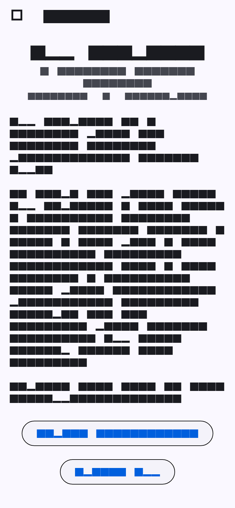
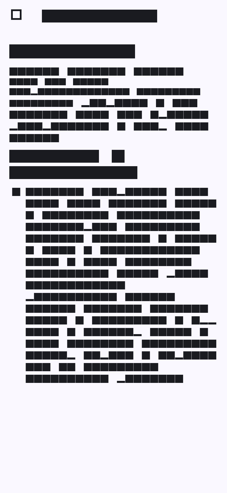
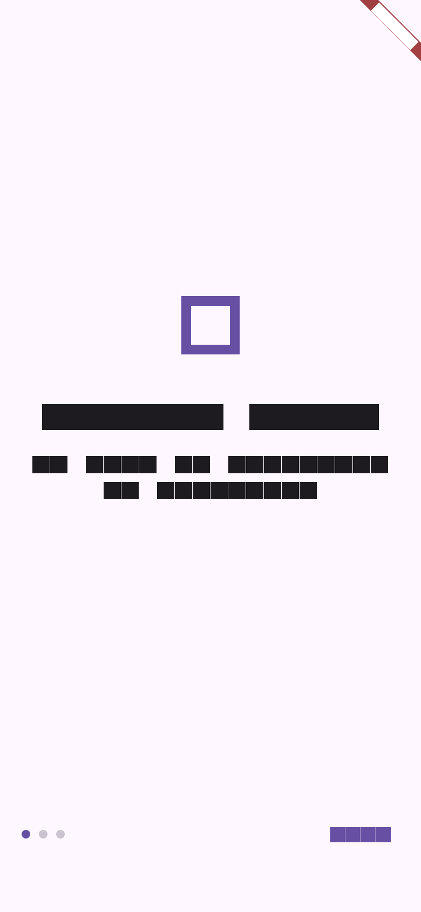
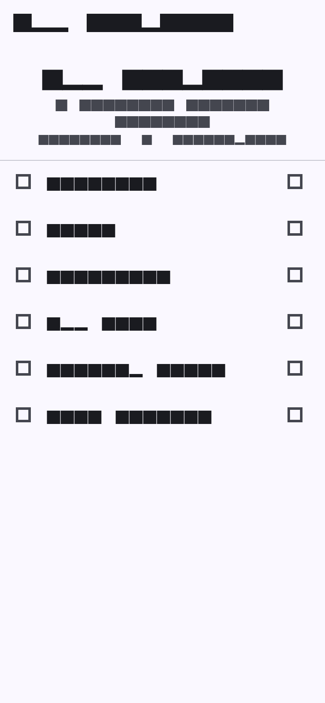
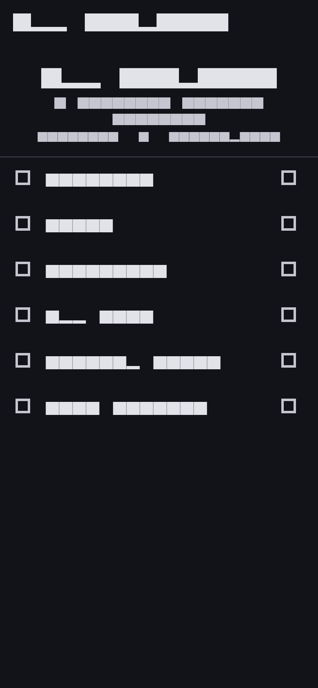
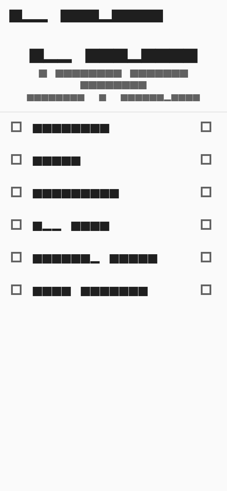
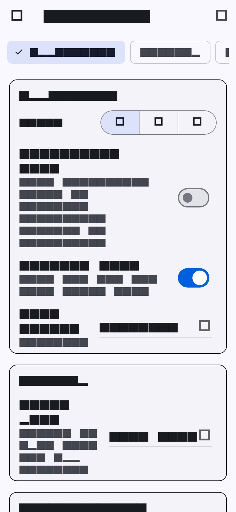

# Screenshots

Newest run first. Each run is preserved in its own `v<version>/<date>_<time>/` folder.

## 2026-07-26 10:41:14 — v0.1.0+1

_version: v0.1.0+1 · date: 2026-07-26 10:41:14 · branch: demo_

### About

### App Logs

### Changelog

### Intro

### Main Menu

### Main Menu Dark

### Main Menu Minimalist

### Settings

### Settings Search

### Startup Times

### Test Results

---

Newest run first. Each run is preserved in its own `v<version>/<date>_<time>/` folder.

